# CialloClaw 架构设计文档（修订版 v8）

## 1. 文档目的

本文档用于将 CialloClaw 的产品定义、交互规则、模块职责、治理要求、技术选型与协作方式，收敛为可实施的系统架构方案。

CialloClaw 的目标不是做一个以聊天框为中心的桌面 AI，而是做一个 **常驻桌面、低打扰、围绕任务现场承接协作、可确认执行、可恢复回滚** 的桌面协作 Agent。

产品主形态由以下部分组成：

- **悬浮球**：低打扰、就近发起。
- **轻量承接层**：在任务现场完成识别、确认、短反馈。
- **仪表盘工作台**：查看完整任务、成果、安全与记忆。
- **后台能力系统**：完成上下文采集、编排、工具调用、模型调用与治理。
- **操作面板**：系统级配置与策略控制。

CialloClaw 的产品定位可理解为：**面向桌面场景的轻量化桌面协作 Agent 包装应用**。在架构层级上，参考 PicoClaw 的轻量 Runtime 思路：强调单机运行、轻量编排、能力插件化、最短执行链路；但在产品形态上，CialloClaw 比 PicoClaw 更强调 **桌面交互承接、任务状态可视化、安全确认、恢复机制、恢复点管理与本地优先的数据闭环**。

文档约束：

- 架构分层
- 前后端边界清晰
- 技术栈边界
- 数据结构统一
- 命名统一
- AI 生成代码的接入方式
- P0 演示主链路优先级
- Windows 优先、兼顾未来跨平台抽象
- LLM / AI 服务接入方式统一

---

## 2. 架构设计原则

### 2.1 总体原则

1. **桌面现场优先**：优先围绕当前页面、选中文本、拖入文件、错误信息、系统状态承接需求，而不是先让用户进入聊天页补上下文。
2. **轻量承接优先**：轻量对话、意图确认与即时结果优先由悬浮球附近的气泡和下方轻量操作区承接；只有需要完整状态或持续任务时才进入仪表盘。
3. **先提示、再确认、后执行**：尤其是改文件、发消息、系统动作、工作区外写入等场景，必须经过风险评估、授权确认、审计记录和恢复点保护。
4. **事件驱动、可恢复**：系统内部执行链路采用“观察—规划—执行—校验—持久化—恢复”的闭环，所有关键步骤进入事件流，并在关键边界保存 checkpoint。
5. **记忆与运行态分离**：长期经验记忆、阶段总结、画像，与任务运行时状态、审计日志、恢复点严格分层，避免数据混用。
6. **Windows 优先、跨平台预留**：当前只开发 Windows 版本；Linux 与 macOS 暂不进入实现和交付范围，但文件系统、路径、进程、屏幕采集、通知、快捷键、剪贴板、执行后端等能力仍必须先定义抽象接口，避免未来扩展时重写核心逻辑。
7. **抽象先于平台细节**：文件系统、路径、进程、容器执行、屏幕采集、通知、快捷键、剪贴板等能力必须先定义抽象接口，再分别做平台实现。
8. **前后端严格解耦**：前端桌面壳与后端 Harness 通过 **JSON-RPC 2.0** 通信；后端在 JSON-RPC 边界以内闭合，不感知 Tauri、React、页面路由、前端组件树等实现细节。
9. **跨语言通信优先使用标准协议**：前后端统一使用 **JSON-RPC 2.0**，以降低 Go / TypeScript / Node worker 之间的接入成本。
10. **AI 受约束接入**：AI 编码工具只能在统一命名、统一目录、统一协议、统一模板下生成代码，不能绕开架构约束自由发挥。
11. **主链路优先**：所有人必须先服务 P0 闭环，不能直接从 PRD 按各自理解开写。
12. **模型接入标准化**：当前直接对接标准 API，优先使用 OpenAI 官方 Responses API SDK；模型切换主要通过模型 ID、端点与配置切换完成，不额外设计一层重量级 Provider 抽象体系。

### 2.2 不做原则

- 不做以终端为主入口的 Agent 壳。
- 不做以流程编排为中心的重平台。
- 不做默认静默执行高风险动作的强接管工具。
- 不把聊天窗口作为默认主入口。
- 不把桌面 UI 与业务后端强耦合成不可替换的大一体模块。
- 不让每个人按自己的 AI Prompt 风格各写一套结构。
- 不让所有人直接拿 PRD 开始实现。
- 不允许在未对齐命名、状态、数据结构之前进入大面积编码。
- 不允许代码里写死 Windows 盘符、反斜杠路径或平台专属行为作为主逻辑。
- 不在当前阶段实现 Linux / macOS 的部署、安装、分发与平台专属特性闭环。

---

## 3. 总体架构设计

### 3.1 架构总览

CialloClaw 采用 **“前端架构 + JSON-RPC 协议边界 + 后端 Harness 架构”** 的总体方案。前后端职责明确分离，前端只负责桌面交互承接与状态呈现，后端 Harness 只负责任务运行、能力编排、治理与数据闭环；两者之间唯一稳定边界为 **JSON-RPC 2.0**。

### 3.2 前端架构总览

前端采用 **“运行环境 + 表现层 + 应用层 + 状态管理层 + 服务层 + 平台集成层”** 的结构。前端的设计重点不是传统后台页面树，而是围绕悬浮球近场交互、气泡生命周期、轻量输入、结果分流和低频仪表盘展开。

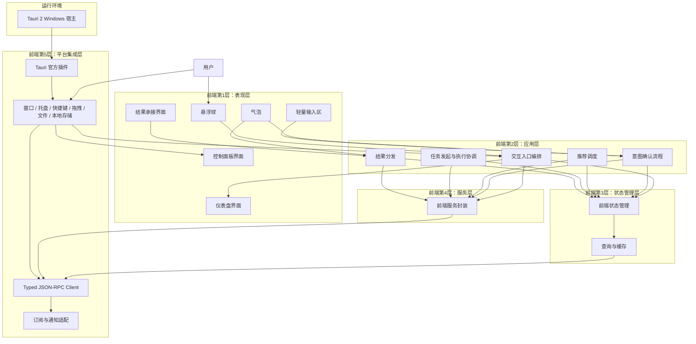
```mermaid
flowchart TB
    U[用户]

    subgraph ENV[运行环境]
        direction LR
        TAURI[Tauri 2 Windows 宿主]
    end

    subgraph F1[前端第1层：表现层]
        direction LR
        FB[悬浮球]
        BUBBLE[气泡]
        INPUT[轻量输入区]
        DASH[仪表盘界面]
        RESULT[结果承接界面]
        PANEL[控制面板界面]
    end

    subgraph F2[前端第2层：应用层]
        direction LR
        ENTRY[交互入口编排]
        CONFIRM[意图确认流程]
        RECOMMEND[推荐调度]
        COORD[任务发起与执行协调]
        DISPATCH[结果分发]
    end

    subgraph F3[前端第3层：状态管理层]
        direction LR
        STATE[前端状态管理]
        QUERY[查询与缓存]
    end

    subgraph F4[前端第4层：服务层]
        direction LR
        SERVICES[前端服务封装]
    end

    subgraph F5[前端第5层：平台集成层]
        direction LR
        TPLUG[Tauri 官方插件]
        RPC[Typed JSON-RPC Client]
        SUB[订阅与通知适配]
        PLATFORM[窗口 / 托盘 / 快捷键 / 拖拽 / 文件 / 本地存储]
    end

    U --> FB
    U --> PLATFORM

    TAURI --> TPLUG
    TPLUG --> PLATFORM

    FB --> ENTRY
    BUBBLE --> CONFIRM
    BUBBLE --> DISPATCH
    INPUT --> CONFIRM
    RESULT --> DISPATCH
    PLATFORM --> PANEL
    ENTRY --> DASH

    ENTRY --> STATE
    CONFIRM --> STATE
    RECOMMEND --> STATE
    COORD --> STATE
    DISPATCH --> STATE

    ENTRY --> SERVICES
    CONFIRM --> SERVICES
    RECOMMEND --> SERVICES
    COORD --> SERVICES
    DISPATCH --> SERVICES

    STATE --> QUERY
    QUERY --> RPC
    SERVICES --> RPC
    RPC --> SUB
    PLATFORM --> RPC
    PLATFORM --> ENTRY
```

### 3.3 后端 Harness 架构总览

后端采用 **“接口接入层 + Harness 内核层 + 能力接入层 + 治理安全层 + 数据存储层 + 平台与执行适配层”** 的结构。

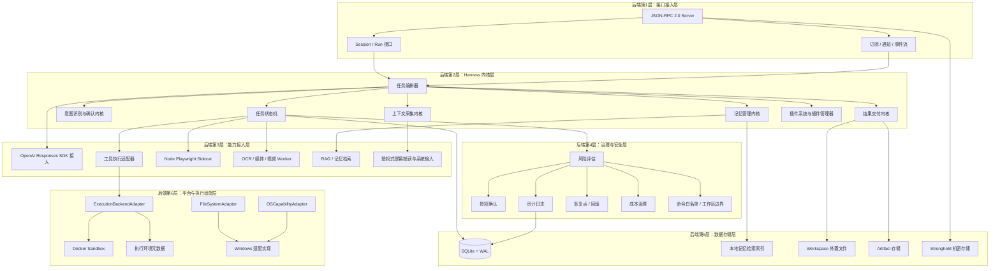
```mermaid
flowchart TB
    subgraph B1[后端第1层：接口接入层]
        direction LR
        JRPCS[JSON-RPC 2.0 Server]
        SESSION[Session / Run 接口]
        STREAM[订阅 / 通知 / 事件流]
    end

    subgraph B2[后端第2层：Harness 内核层]
        direction LR
        ORCH[任务编排器]
        CTX[上下文采集内核]
        INTENT[意图识别与确认内核]
        TASK[任务状态机]
        MEMORY[记忆管理内核]
        DELIVERY[结果交付内核]
        PLUGIN[插件系统与插件管理器]
    end

    subgraph B3[后端第3层：能力接入层]
        direction LR
        MODEL[OpenAI Responses SDK 接入]
        TOOL[工具执行适配器]
        NODEPW[Node Playwright Sidecar]
        OCR[OCR / 媒体 / 视频 Worker]
        RAG[RAG / 记忆检索]
        SENSE[授权式屏幕捕获与系统输入]
    end

    subgraph B4[后端第4层：治理与安全层]
        direction LR
        SAFE[风险评估]
        APPROVAL[授权确认]
        AUDIT[审计日志]
        SNAP[恢复点 / 回滚]
        BUDGET[成本治理]
        POLICY[命令白名单 / 工作区边界]
    end

    subgraph B5[后端第5层：数据存储层]
        direction LR
        SQLITE[(SQLite + WAL)]
        VSTORE[本地记忆检索索引]
        WORKSPACE[Workspace 外置文件]
        ARTIFACT[Artifact 存储]
        SECRET[Stronghold 机密存储]
    end

    subgraph B6[后端第6层：平台与执行适配层]
        direction LR
        FSABS[FileSystemAdapter]
        OSABS[OSCapabilityAdapter]
        EXECABS[ExecutionBackendAdapter]
        DOCKER[Docker Sandbox]
        EXECMETA[执行环境元数据]
        WIN[Windows 适配实现]
    end

    JRPCS --> SESSION
    JRPCS --> STREAM

    SESSION --> ORCH
    STREAM --> ORCH

    ORCH --> CTX
    ORCH --> INTENT
    ORCH --> TASK
    ORCH --> MEMORY
    ORCH --> DELIVERY
    ORCH --> PLUGIN

    ORCH --> MODEL
    TASK --> TOOL
    TASK --> NODEPW
    TASK --> OCR
    MEMORY --> RAG
    CTX --> SENSE

    TASK --> SAFE
    SAFE --> APPROVAL
    SAFE --> AUDIT
    SAFE --> SNAP
    SAFE --> BUDGET
    SAFE --> POLICY

    TASK --> SQLITE
    MEMORY --> VSTORE
    DELIVERY --> WORKSPACE
    DELIVERY --> ARTIFACT
    AUDIT --> SQLITE
    JRPCS --> SECRET

    TOOL --> EXECABS
    FSABS --> WIN
    OSABS --> WIN
    EXECABS --> DOCKER
    EXECABS --> EXECMETA
```

### 3.4 前后端通信边界

前后端通信边界固定为 **JSON-RPC 2.0**。该边界之外属于前端，边界之内属于后端 Harness。

约束如下：

- Tauri、React、Vite、前端路由、组件树、桌面视图生命周期均属于前端架构，不进入后端分层。
- 后端 Harness 只暴露 JSON-RPC 方法、通知与订阅，不感知调用方是否来自 Tauri、WebView、CLI 或其他前端壳。
- 后端不依赖前端组件状态，不接收 UI 级概念作为内部核心对象。
- 所有可持续扩展的前后端接口，统一定义为 JSON-RPC method、params、result、notification event。

### 3.5 层次划分说明

#### 前端第 1 层：桌面宿主层

负责承载 Tauri 2 Windows 宿主、官方插件与多窗口生命周期，管理窗口打开、托盘唤起、快捷键、通知、文件桥接与更新链路。

#### 前端第 2 层：表现层

负责悬浮球、气泡、轻量输入区、仪表盘、结果承接界面与控制面板等界面呈现，强调锚点交互、低打扰状态反馈和多出口结果展示。

#### 前端第 3 层：应用编排层

负责入口编排、意图确认、推荐调度、任务执行协调与结果分发，把不同触发方式统一收敛为一致的前端任务承接流程。

#### 前端第 4 层：状态与服务层

负责前端交互态、查询缓存、任务视图映射和服务封装，隔离组件层与协议调用层，避免前端状态和后端数据访问散落到具体页面组件中。

#### 前端第 5 层：平台集成与协议适配层

负责 Typed JSON-RPC Client、订阅与通知桥接，以及窗口、托盘、快捷键、拖拽、文件系统和本地存储等平台能力接入。

#### 后端第 1 层：接口接入层

负责 JSON-RPC Server、session/run 生命周期、订阅与通知管理，是后端唯一对外暴露的接口边界。

#### 后端第 2 层：Harness 内核层

负责任务编排、上下文采集、意图识别、状态机、记忆管理、结果交付和插件系统，是后端核心闭环。

#### 后端第 3 层：能力接入层

负责模型调用、工具执行、浏览器自动化、OCR、媒体处理、RAG 检索、屏幕与系统输入等能力接入。

#### 后端第 4 层：治理与安全层

负责风险评估、授权、审计、恢复点、预算、边界校验，是执行链路的强约束层。

#### 后端第 5 层：数据存储层

负责结构化状态、本地检索索引、工作区文件、大对象与机密存储。

#### 后端第 6 层：平台与执行适配层

负责 Windows 实现、文件系统抽象、系统能力抽象、执行后端适配，以及未来跨平台扩展所需的底层接口。

### 3.6 平台与跨平台原则

当前版本只开发 **Windows**，安装、更新、分发、权限适配、宿主能力、执行链路都以 Windows 为唯一落地目标。

同时，为避免后续扩展时重写核心逻辑，仍需遵守以下约束：

- **共享部分**：React 前端、JSON-RPC 协议、Go 本地服务、数据模型、事件协议、任务协议。
- **抽象保留**：文件系统、路径、通知、快捷键、剪贴板、屏幕授权、执行后端适配、进程管理。
- **当前不实现**：Linux / macOS 的安装包、分发链路、平台专属功能闭环。
- **路径与文件系统约束**：
  - 不允许在业务代码中直接拼接平台路径分隔符。
  - 不允许在业务逻辑中写死 `C:\`、`D:\`、`/Users/...`、`/home/...`。
  - 所有路径必须通过 `FileSystemAdapter` 统一归一化。
  - 所有工作区访问必须以 workspace root 为边界。
  - Windows 当前实现必须兼容未来 POSIX 路径规则，不把反斜杠处理写入上层业务逻辑。

### 3.7 平台适配层设计

为保证未来跨平台扩展性，后端 Harness 内部必须引入 **Platform Adapter Layer**。该层至少抽象以下接口：

- `FileSystemAdapter`
  - `Join(...)`
  - `Clean(path)`
  - `Abs(path)`
  - `Rel(base, target)`
  - `Normalize(path)`
  - `EnsureWithinWorkspace(path)`
  - `ReadFile(path)`
  - `WriteFile(path, content)`
  - `Move(src, dst)`
  - `MkdirAll(path)`

- `PathPolicy`
  - 屏蔽盘符差异
  - 屏蔽分隔符差异
  - 统一路径合法性校验
  - 统一 workspace 边界校验

- `OSCapabilityAdapter`
  - 托盘
  - 通知
  - 快捷键
  - 剪贴板
  - 屏幕授权
  - 外部命令启动
  - sidecar 生命周期

- `ExecutionBackendAdapter`
  - Docker
  - SandboxProfile
  - ResourceLimit
  - Remote Backend

- `StorageAdapter`
  - SQLite
  - 本地 RAG 索引
  - Artifact 外置存储
  - Stronghold 机密存储

业务代码必须依赖接口，不得依赖平台特有路径或 API 名称。

---

## 4. 功能架构设计

## 4.1 入口与轻量承接架构

### 4.1.1 入口类型

悬浮球支持以下入口：

- 左键单击：轻量接近或承接当前对象。
- 左键双击：打开仪表盘。
- 左键长按：语音主入口，上滑锁定、下滑取消。
- 鼠标悬停：轻量输入 + 主动推荐。
- 文件拖拽：文件解析后进入意图确认。
- 文本选中：进入可操作提示态，再进入意图确认。

### 4.1.2 轻量承接层职责

轻量承接层不是聊天线程，而是任务现场的短链路承接层，负责：

- 识别任务对象
- 做意图分析
- 提供确认/修正
- 输出短结果或状态
- 决定是否分流到文档、结果页、任务详情

## 4.2 任务状态架构

任务状态模块负责承接“已经被 Agent 接手并正在推进的工作”。核心结构包括：

- **任务头部**：名称、来源、状态、开始时间、更新时间。
- **步骤时间线**：已完成、进行中、未开始。
- **关键上下文**：本轮任务使用的资料、记忆摘要、约束条件。
- **成果区**：草稿、文件、网页、模板、清单。
- **信任摘要**：风险状态、待授权数、恢复点、边界触发。
- **操作区**：暂停、继续、取消、修改、重启、查看安全详情。

## 4.3 便签协作 / 巡检架构

便签协作模块是“未来安排向执行任务转换”的中间层。分类结构：

- 近期要做
- 后续安排
- 重复事项
- 已结束事项

底层能力包括：

- 指定 `.md` 任务文件夹监听
- Markdown 任务项识别
- 日期、优先级、状态、标签提取
- 巡检频率、变更即巡检、启动时巡检
- 到期提醒、长时间未处理提醒
- 下一步动作建议、打开资料、生成草稿

## 4.4 镜子记忆架构

镜子模块不是聊天记录页，而是长期协作的认知层。分为三层：

1. **短期记忆**：支撑连续任务理解。
2. **长期记忆**：偏好、习惯、阶段性信息沉淀。
3. **镜子总结**：日报、阶段总结、用户画像显性展示。

设计约束：

- 默认本地存储，可一键开关
- 长期记忆与运行态恢复状态分离
- 用户可见、可管理、可删除
- 周期总结和画像更新受操作面板配置控制
- 长期记忆支持 **本地 RAG 检索索引**，但写入与检索必须与运行态状态解耦

## 4.5 安全卫士架构

安全卫士是治理核心，负责：

- 工作区边界控制
- 风险分级
- 授权确认
- 影响范围展示
- 一键中断
- 恢复与回滚
- Token 与费用治理
- 审计日志
- Docker 沙盒执行后端的策略接入

风险模型采用绿/黄/红三级：

- **绿灯**：静默执行，仅记录。
- **黄灯**：执行前询问。
- **红灯**：必须人工确认。

## 4.6 操作面板架构

操作面板是系统配置中心，不承接任务，不替代仪表盘。主入口为托盘右键。信息架构分为：

- 通用设置
- 外观与桌面入口
- 记忆
- 任务与自动化
- 数据与日志
- 模型与密钥
- 关于

---

## 5. 核心实现逻辑图

## 5.1 主动输入闭环实现逻辑图

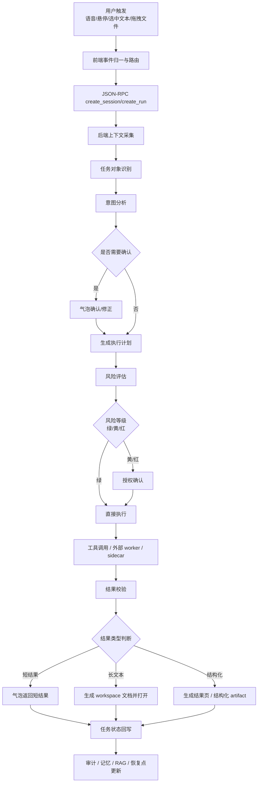
```mermaid
flowchart TB
    A[用户触发\n语音/悬停/选中文本/拖拽文件]
    B[前端事件归一与路由]
    C[JSON-RPC create_session/create_run]
    D[后端上下文采集]
    E[任务对象识别]
    F[意图分析]
    G{是否需要确认}
    H[气泡确认/修正]
    I[生成执行计划]
    J[风险评估]
    K{风险等级\n绿/黄/红}
    L[直接执行]
    M[授权确认]
    N[工具调用 / 外部 worker / sidecar]
    O[结果校验]
    P{结果类型判断}
    Q[气泡返回短结果]
    R[生成 workspace 文档并打开]
    S[生成结果页 / 结构化 artifact]
    T[任务状态回写]
    U[审计 / 记忆 / RAG / 恢复点更新]

    A --> B --> C --> D --> E --> F --> G
    G -- 是 --> H --> I
    G -- 否 --> I
    I --> J --> K
    K -- 绿 --> L
    K -- 黄/红 --> M --> L
    L --> N --> O --> P
    P -- 短结果 --> Q --> T
    P -- 长文本 --> R --> T
    P -- 结构化 --> S --> T
    T --> U
```

## 5.2 任务巡检转任务实现逻辑图

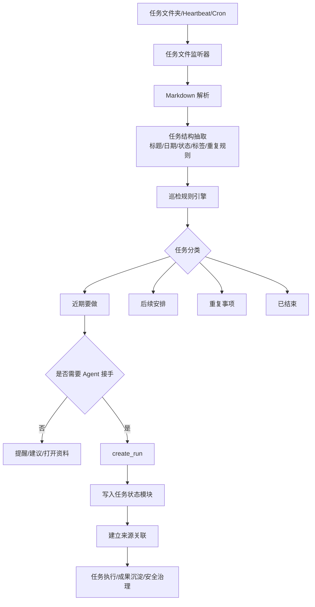
```mermaid
flowchart TB
    A[任务文件夹/Heartbeat/Cron]
    B[任务文件监听器]
    C[Markdown 解析]
    D[任务结构抽取\n标题/日期/状态/标签/重复规则]
    E[巡检规则引擎]
    F{任务分类}
    G[近期要做]
    H[后续安排]
    I[重复事项]
    J[已结束]
    K{是否需要 Agent 接手}
    L[提醒/建议/打开资料]
    M[create_run]
    N[写入任务状态模块]
    O[建立来源关联]
    P[任务执行/成果沉淀/安全治理]

    A --> B --> C --> D --> E --> F
    F --> G --> K
    F --> H
    F --> I
    F --> J
    K -- 否 --> L
    K -- 是 --> M --> N --> O --> P
```

## 5.3 高风险执行与回滚闭环逻辑图

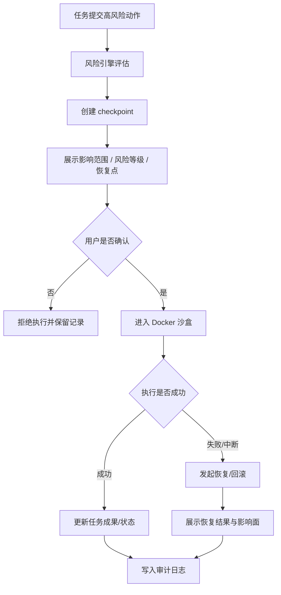
```mermaid
flowchart TB
    A[任务提交高风险动作]
    B[风险引擎评估]
    C[创建 checkpoint]
    D[展示影响范围 / 风险等级 / 恢复点]
    E{用户是否确认}
    F[拒绝执行并保留记录]
    G[进入 Docker 沙盒]
    H{执行是否成功}
    I[更新任务成果/状态]
    J[写入审计日志]
    K[发起恢复/回滚]
    L[展示恢复结果与影响面]

    A --> B --> C --> D --> E
    E -- 否 --> F
    E -- 是 --> G --> H
    H -- 成功 --> I --> J
    H -- 失败/中断 --> K --> L --> J
```

## 5.4 记忆写入与本地检索闭环逻辑图

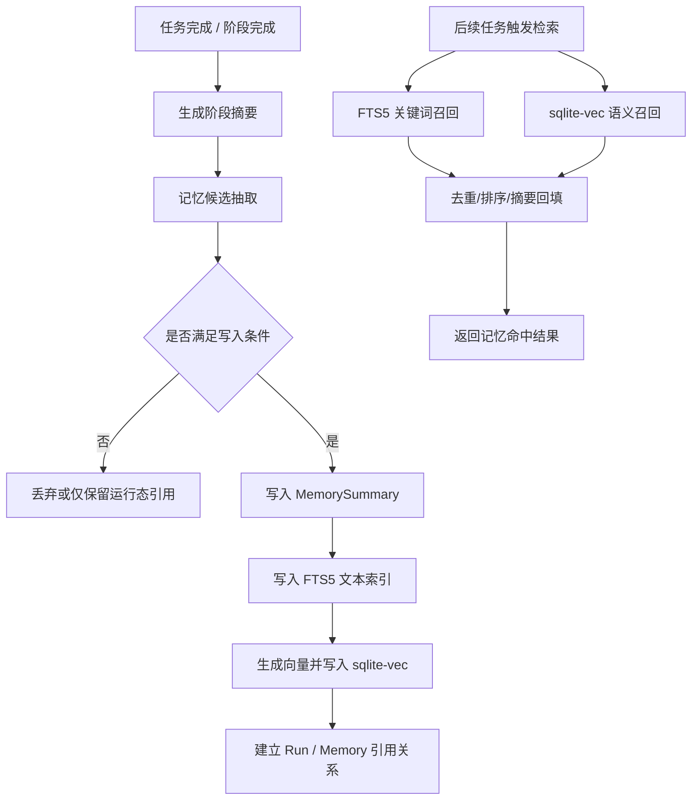
```mermaid
flowchart TB
    A[任务完成 / 阶段完成]
    B[生成阶段摘要]
    C[记忆候选抽取]
    D{是否满足写入条件}
    E[丢弃或仅保留运行态引用]
    F[写入 MemorySummary]
    G[写入 FTS5 文本索引]
    H[生成向量并写入 sqlite-vec]
    I[建立 Run / Memory 引用关系]
    J[后续任务触发检索]
    K[FTS5 关键词召回]
    L[sqlite-vec 语义召回]
    M[去重/排序/摘要回填]
    N[返回记忆命中结果]

    A --> B --> C --> D
    D -- 否 --> E
    D -- 是 --> F --> G --> H --> I
    J --> K
    J --> L
    K --> M
    L --> M --> N
```

## 5.5 插件系统运行与仪表盘同步逻辑图

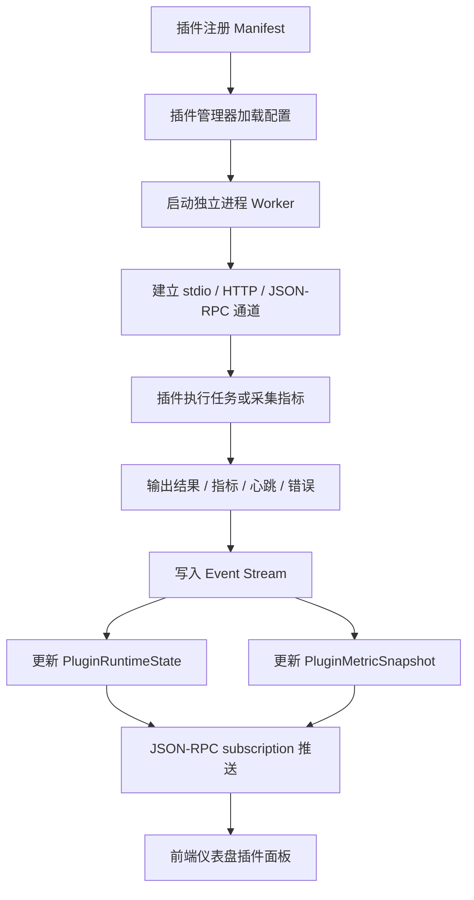
```mermaid
flowchart TB
    A[插件注册 Manifest]
    B[插件管理器加载配置]
    C[启动独立进程 Worker]
    D[建立 stdio / HTTP / JSON-RPC 通道]
    E[插件执行任务或采集指标]
    F[输出结果 / 指标 / 心跳 / 错误]
    G[写入 Event Stream]
    H[更新 PluginRuntimeState]
    I[更新 PluginMetricSnapshot]
    J[JSON-RPC subscription 推送]
    K[前端仪表盘插件面板]

    A --> B --> C --> D --> E --> F
    F --> G
    G --> H
    G --> I
    H --> J
    I --> J
    J --> K
```

## 5.6 仪表盘订阅与任务视图刷新逻辑图

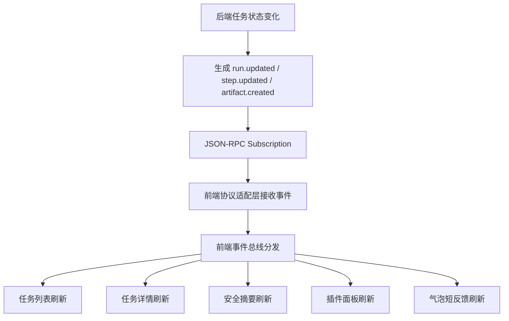
```mermaid
flowchart TB
    A[后端任务状态变化]
    B[生成 run.updated / step.updated / artifact.created]
    C[JSON-RPC Subscription]
    D[前端协议适配层接收事件]
    E[前端事件总线分发]
    F[任务列表刷新]
    G[任务详情刷新]
    H[安全摘要刷新]
    I[插件面板刷新]
    J[气泡短反馈刷新]

    A --> B --> C --> D --> E
    E --> F
    E --> G
    E --> H
    E --> I
    E --> J
```

---

## 6. 关键时序图与前端状态图

## 6.1 文本选中 / 文件拖拽后的意图确认与执行时序图

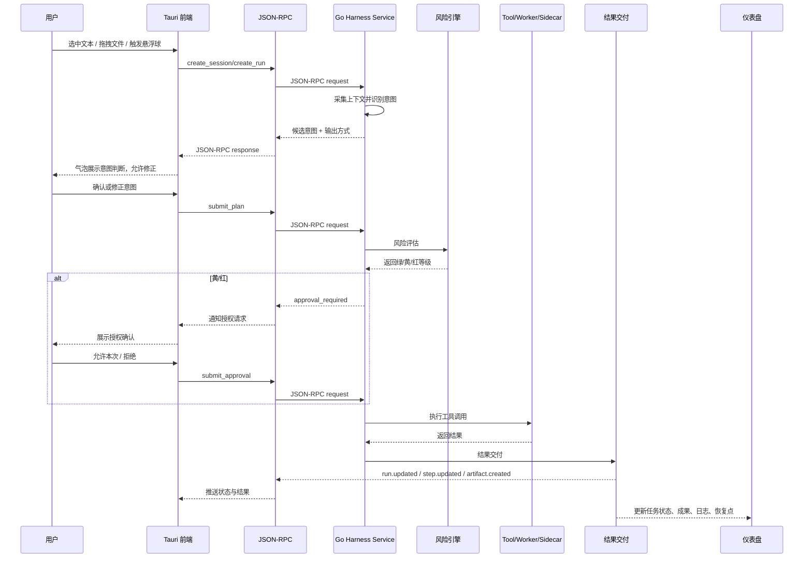
```mermaid
sequenceDiagram
    participant User as 用户
    participant UI as Tauri 前端
    participant RPC as JSON-RPC
    participant API as Go Harness Service
    participant SAFE as 风险引擎
    participant TOOL as Tool/Worker/Sidecar
    participant DEL as 结果交付
    participant DASH as 仪表盘

    User->>UI: 选中文本 / 拖拽文件 / 触发悬浮球
    UI->>RPC: create_session/create_run
    RPC->>API: JSON-RPC request
    API->>API: 采集上下文并识别意图
    API-->>RPC: 候选意图 + 输出方式
    RPC-->>UI: JSON-RPC response
    UI-->>User: 气泡展示意图判断，允许修正
    User->>UI: 确认或修正意图
    UI->>RPC: submit_plan
    RPC->>API: JSON-RPC request
    API->>SAFE: 风险评估
    SAFE-->>API: 返回绿/黄/红等级
    alt 黄/红
        API-->>RPC: approval_required
        RPC-->>UI: 通知授权请求
        UI-->>User: 展示授权确认
        User->>UI: 允许本次 / 拒绝
        UI->>RPC: submit_approval
        RPC->>API: JSON-RPC request
    end
    API->>TOOL: 执行工具调用
    TOOL-->>API: 返回结果
    API->>DEL: 结果交付
    DEL-->>RPC: run.updated / step.updated / artifact.created
    RPC-->>UI: 推送状态与结果
    DEL-->>DASH: 更新任务状态、成果、日志、恢复点
```

## 6.2 高风险执行、授权、回滚时序图

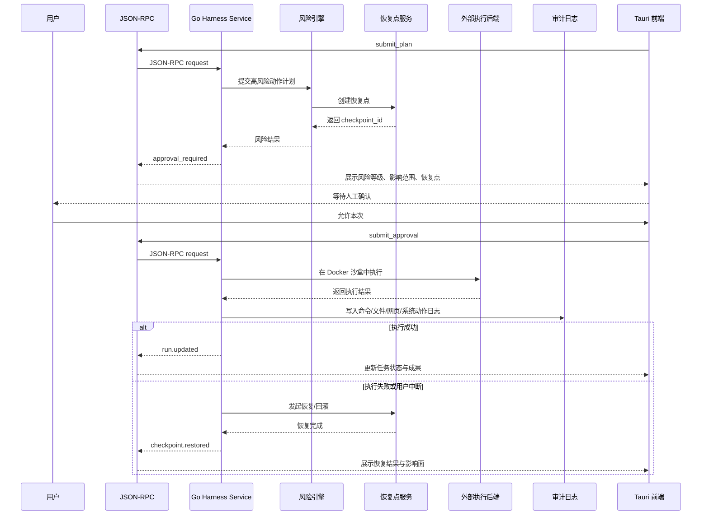
```mermaid
sequenceDiagram
    participant User as 用户
    participant RPC as JSON-RPC
    participant API as Go Harness Service
    participant SAFE as 风险引擎
    participant SNAP as 恢复点服务
    participant EXEC as 外部执行后端
    participant AUDIT as 审计日志
    participant UI as Tauri 前端

    UI->>RPC: submit_plan
    RPC->>API: JSON-RPC request
    API->>SAFE: 提交高风险动作计划
    SAFE->>SNAP: 创建恢复点
    SNAP-->>SAFE: 返回 checkpoint_id
    SAFE-->>API: 风险结果
    API-->>RPC: approval_required
    RPC-->>UI: 展示风险等级、影响范围、恢复点
    UI-->>User: 等待人工确认
    User->>UI: 允许本次
    UI->>RPC: submit_approval
    RPC->>API: JSON-RPC request
    API->>EXEC: 在 Docker 沙盒中执行
    EXEC-->>API: 返回执行结果
    API->>AUDIT: 写入命令/文件/网页/系统动作日志
    alt 执行成功
        API-->>RPC: run.updated
        RPC-->>UI: 更新任务状态与成果
    else 执行失败或用户中断
        API->>SNAP: 发起恢复/回滚
        SNAP-->>API: 恢复完成
        API-->>RPC: checkpoint.restored
        RPC-->>UI: 展示恢复结果与影响面
    end
```

## 6.3 记忆写入与检索时序图

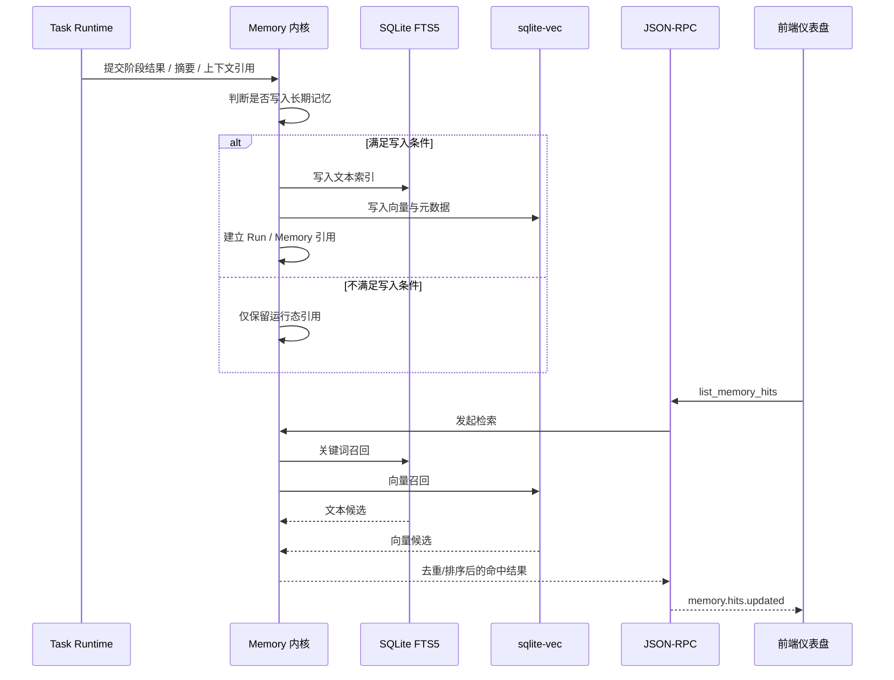
```mermaid
sequenceDiagram
    participant TASK as Task Runtime
    participant MEM as Memory 内核
    participant FTS as SQLite FTS5
    participant VEC as sqlite-vec
    participant RPC as JSON-RPC
    participant UI as 前端仪表盘

    TASK->>MEM: 提交阶段结果 / 摘要 / 上下文引用
    MEM->>MEM: 判断是否写入长期记忆
    alt 满足写入条件
        MEM->>FTS: 写入文本索引
        MEM->>VEC: 写入向量与元数据
        MEM->>MEM: 建立 Run / Memory 引用
    else 不满足写入条件
        MEM->>MEM: 仅保留运行态引用
    end
    UI->>RPC: list_memory_hits
    RPC->>MEM: 发起检索
    MEM->>FTS: 关键词召回
    MEM->>VEC: 向量召回
    FTS-->>MEM: 文本候选
    VEC-->>MEM: 向量候选
    MEM-->>RPC: 去重/排序后的命中结果
    RPC-->>UI: memory.hits.updated
```

## 6.4 插件执行与仪表盘展示时序图

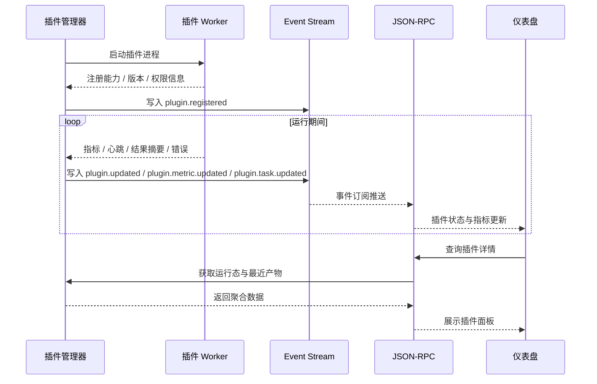
```mermaid
sequenceDiagram
    participant PM as 插件管理器
    participant PLUG as 插件 Worker
    participant EVT as Event Stream
    participant RPC as JSON-RPC
    participant UI as 仪表盘

    PM->>PLUG: 启动插件进程
    PLUG-->>PM: 注册能力 / 版本 / 权限信息
    PM->>EVT: 写入 plugin.registered
    loop 运行期间
        PLUG-->>PM: 指标 / 心跳 / 结果摘要 / 错误
        PM->>EVT: 写入 plugin.updated / plugin.metric.updated / plugin.task.updated
        EVT-->>RPC: 事件订阅推送
        RPC-->>UI: 插件状态与指标更新
    end
    UI->>RPC: 查询插件详情
    RPC->>PM: 获取运行态与最近产物
    PM-->>RPC: 返回聚合数据
    RPC-->>UI: 展示插件面板
```

## 6.5 启动初始化与恢复时序图

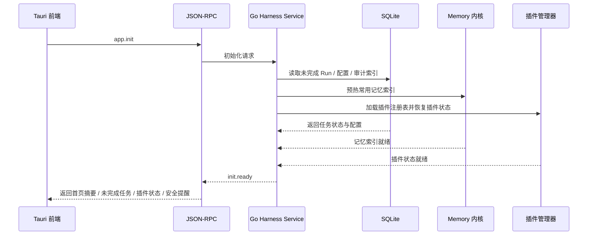
```mermaid
sequenceDiagram
    participant UI as Tauri 前端
    participant RPC as JSON-RPC
    participant API as Go Harness Service
    participant DB as SQLite
    participant MEM as Memory 内核
    participant PM as 插件管理器

    UI->>RPC: app.init
    RPC->>API: 初始化请求
    API->>DB: 读取未完成 Run / 配置 / 审计索引
    API->>MEM: 预热常用记忆索引
    API->>PM: 加载插件注册表并恢复插件状态
    DB-->>API: 返回任务状态与配置
    MEM-->>API: 记忆索引就绪
    PM-->>API: 插件状态就绪
    API-->>RPC: init.ready
    RPC-->>UI: 返回首页摘要 / 未完成任务 / 插件状态 / 安全提醒
```

## 6.6 长按悬浮球发起语音协作时序图

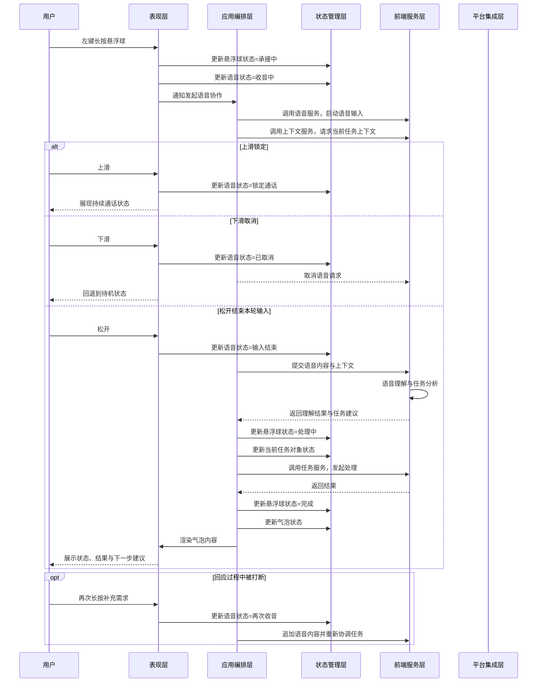
```mermaid
sequenceDiagram
    participant U as 用户
    participant P as 表现层
    participant A as 应用编排层
    participant S as 状态管理层
    participant V as 前端服务层
    participant I as 平台集成层

    U->>P: 左键长按悬浮球
    P->>S: 更新悬浮球状态=承接中
    P->>S: 更新语音状态=收音中
    P->>A: 通知发起语音协作
    A->>V: 调用语音服务，启动语音输入
    A->>V: 调用上下文服务，请求当前任务上下文

    alt 上滑锁定
        U->>P: 上滑
        P->>S: 更新语音状态=锁定通话
        P-->>U: 展现持续通话状态
    else 下滑取消
        U->>P: 下滑
        P->>S: 更新语音状态=已取消
        A-->>V: 取消语音请求
        P-->>U: 回退到待机状态
    else 松开结束本轮输入
        U->>P: 松开
        P->>S: 更新语音状态=输入结束
        A->>V: 提交语音内容与上下文
        V->>V: 语音理解与任务分析
        V-->>A: 返回理解结果与任务建议
        A->>S: 更新悬浮球状态=处理中
        A->>S: 更新当前任务对象状态
        A->>V: 调用任务服务，发起处理
        V-->>A: 返回结果
        A->>S: 更新悬浮球状态=完成
        A->>S: 更新气泡状态
        A->>P: 渲染气泡内容
        P-->>U: 展示状态、结果与下一步建议
    end

    opt 回应过程中被打断
        U->>P: 再次长按补充需求
        P->>S: 更新语音状态=再次收音
        A->>V: 追加语音内容并重新协调任务
    end
```

## 6.7 悬停悬浮球触发轻量承接时序图

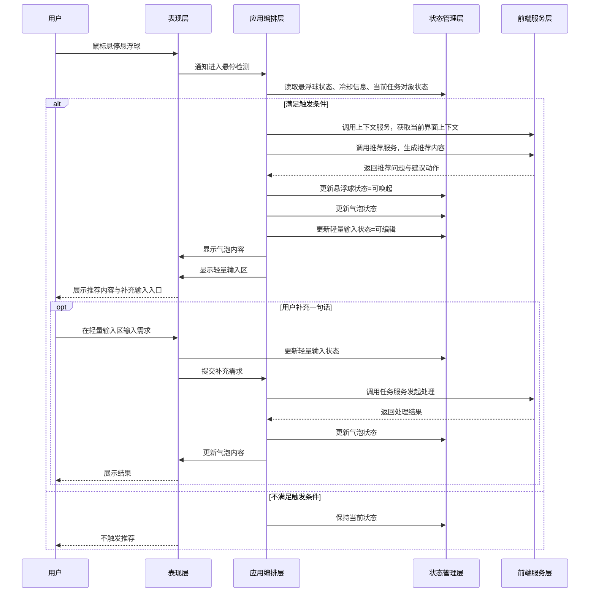
```mermaid
sequenceDiagram
    participant U as 用户
    participant P as 表现层
    participant A as 应用编排层
    participant S as 状态管理层
    participant V as 前端服务层

    U->>P: 鼠标悬停悬浮球
    P->>A: 通知进入悬停检测
    A->>S: 读取悬浮球状态、冷却信息、当前任务对象状态

    alt 满足触发条件
        A->>V: 调用上下文服务，获取当前界面上下文
        A->>V: 调用推荐服务，生成推荐内容
        V-->>A: 返回推荐问题与建议动作
        A->>S: 更新悬浮球状态=可唤起
        A->>S: 更新气泡状态
        A->>S: 更新轻量输入状态=可编辑
        A->>P: 显示气泡内容
        A->>P: 显示轻量输入区
        P-->>U: 展示推荐内容与补充输入入口

        opt 用户补充一句话
            U->>P: 在轻量输入区输入需求
            P->>S: 更新轻量输入状态
            P->>A: 提交补充需求
            A->>V: 调用任务服务发起处理
            V-->>A: 返回处理结果
            A->>S: 更新气泡状态
            A->>P: 更新气泡内容
            P-->>U: 展示结果
        end
    else 不满足触发条件
        A->>S: 保持当前状态
        P-->>U: 不触发推荐
    end
```

## 6.8 协作机会承接与意图确认时序图

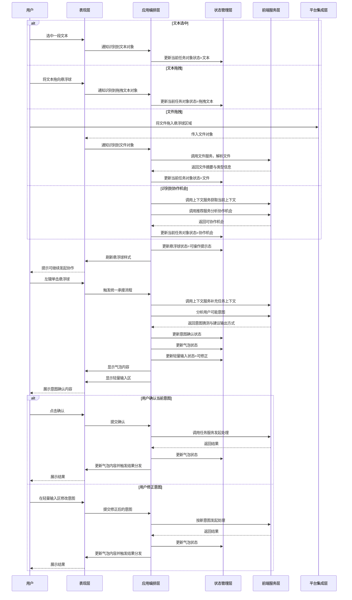
```mermaid
sequenceDiagram
    participant U as 用户
    participant P as 表现层
    participant A as 应用编排层
    participant S as 状态管理层
    participant V as 前端服务层
    participant I as 平台集成层

    alt 文本选中
        U->>P: 选中一段文本
        P->>A: 通知识别到文本对象
        A->>S: 更新当前任务对象状态=文本
    else 文本拖拽
        U->>P: 将文本拖向悬浮球
        P->>A: 通知识别到拖拽文本对象
        A->>S: 更新当前任务对象状态=拖拽文本
    else 文件拖拽
        U->>I: 将文件拖入悬浮球区域
        I-->>P: 传入文件对象
        P->>A: 通知识别到文件对象
        A->>V: 调用文件服务，解析文件
        V-->>A: 返回文件摘要与类型信息
        A->>S: 更新当前任务对象状态=文件
    else 识别到协作机会
        A->>V: 调用上下文服务获取当前上下文
        A->>V: 调用推荐服务分析协作机会
        V-->>A: 返回可协作机会
        A->>S: 更新当前任务对象状态=协作机会
    end

    A->>S: 更新悬浮球状态=可操作提示态
    A->>P: 刷新悬浮球样式
    P-->>U: 提示可继续发起协作

    U->>P: 左键单击悬浮球
    P->>A: 触发统一承接流程
    A->>V: 调用上下文服务补充任务上下文
    A->>V: 分析用户可能意图
    V-->>A: 返回意图猜测与建议输出方式
    A->>S: 更新意图确认状态
    A->>S: 更新气泡状态
    A->>S: 更新轻量输入状态=可修正
    A->>P: 显示气泡内容
    A->>P: 显示轻量输入区
    P-->>U: 展示意图确认内容

    alt 用户确认当前意图
        U->>P: 点击确认
        P->>A: 提交确认
        A->>V: 调用任务服务发起处理
        V-->>A: 返回结果
        A->>S: 更新气泡状态
        A->>P: 更新气泡内容并触发结果分发
        P-->>U: 展示结果
    else 用户修正意图
        U->>P: 在轻量输入区修改意图
        P->>A: 提交修正后的意图
        A->>V: 按新意图发起处理
        V-->>A: 返回结果
        A->>S: 更新气泡状态
        A->>P: 更新气泡内容并触发结果分发
        P-->>U: 展示结果
    end
```

## 6.9 双击悬浮球打开仪表盘时序图

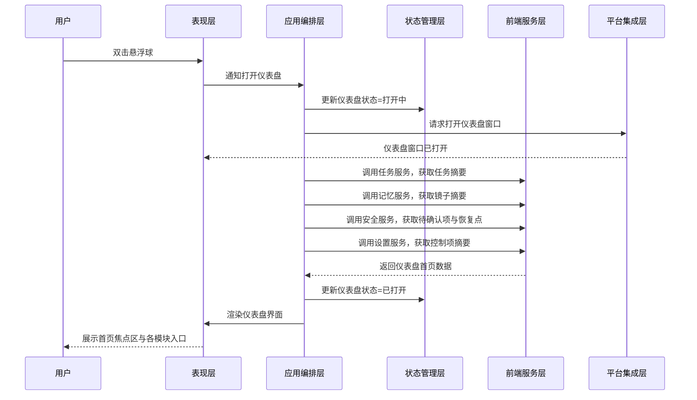
```mermaid
sequenceDiagram
    participant U as 用户
    participant P as 表现层
    participant A as 应用编排层
    participant S as 状态管理层
    participant V as 前端服务层
    participant I as 平台集成层

    U->>P: 双击悬浮球
    P->>A: 通知打开仪表盘
    A->>S: 更新仪表盘状态=打开中
    A->>I: 请求打开仪表盘窗口
    I-->>P: 仪表盘窗口已打开

    A->>V: 调用任务服务，获取任务摘要
    A->>V: 调用记忆服务，获取镜子摘要
    A->>V: 调用安全服务，获取待确认项与恢复点
    A->>V: 调用设置服务，获取控制项摘要

    V-->>A: 返回仪表盘首页数据
    A->>S: 更新仪表盘状态=已打开
    A->>P: 渲染仪表盘界面
    P-->>U: 展示首页焦点区与各模块入口
```

## 6.10 托盘右键打开控制面板时序图

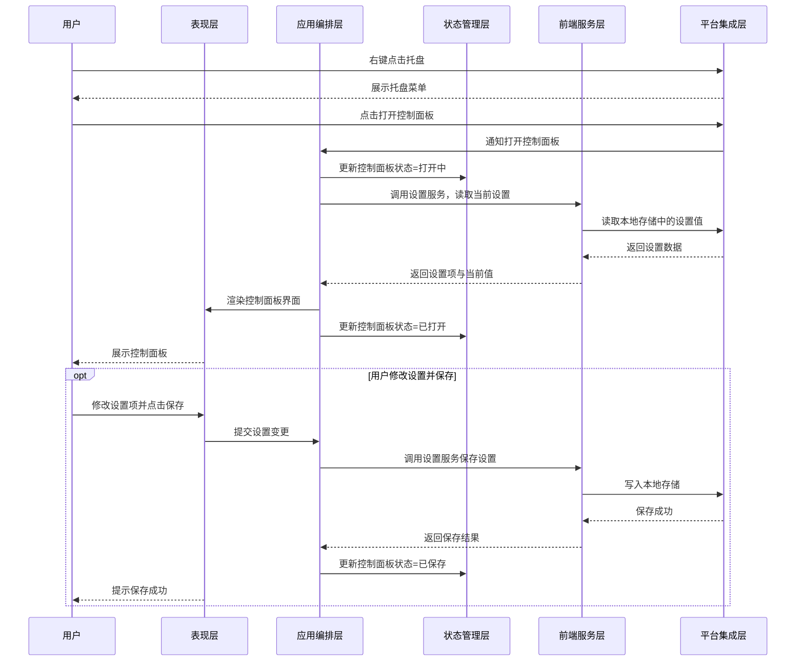
```mermaid
sequenceDiagram
    participant U as 用户
    participant P as 表现层
    participant A as 应用编排层
    participant S as 状态管理层
    participant V as 前端服务层
    participant I as 平台集成层

    U->>I: 右键点击托盘
    I-->>U: 展示托盘菜单
    U->>I: 点击打开控制面板
    I->>A: 通知打开控制面板
    A->>S: 更新控制面板状态=打开中
    A->>V: 调用设置服务，读取当前设置
    V->>I: 读取本地存储中的设置值
    I-->>V: 返回设置数据
    V-->>A: 返回设置项与当前值
    A->>P: 渲染控制面板界面
    A->>S: 更新控制面板状态=已打开
    P-->>U: 展示控制面板

    opt 用户修改设置并保存
        U->>P: 修改设置项并点击保存
        P->>A: 提交设置变更
        A->>V: 调用设置服务保存设置
        V->>I: 写入本地存储
        I-->>V: 保存成功
        V-->>A: 返回保存结果
        A->>S: 更新控制面板状态=已保存
        P-->>U: 提示保存成功
    end
```

## 6.11 任务完成后的结果分发与交付时序图

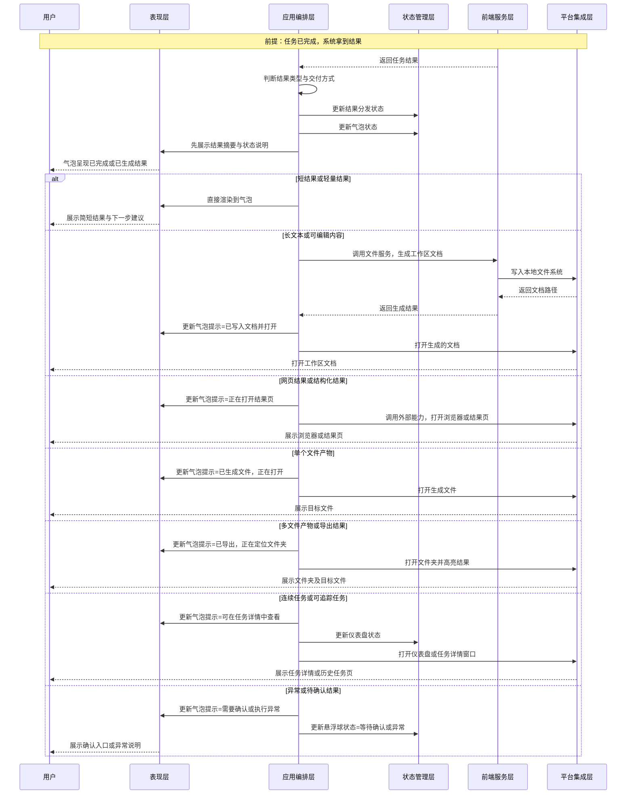
```mermaid
sequenceDiagram
    participant U as 用户
    participant P as 表现层
    participant A as 应用编排层
    participant S as 状态管理层
    participant V as 前端服务层
    participant I as 平台集成层

    Note over U,I: 前提：任务已完成，系统拿到结果

    V-->>A: 返回任务结果
    A->>A: 判断结果类型与交付方式
    A->>S: 更新结果分发状态
    A->>S: 更新气泡状态
    A->>P: 先展示结果摘要与状态说明
    P-->>U: 气泡呈现已完成或已生成结果

    alt 短结果或轻量结果
        A->>P: 直接渲染到气泡
        P-->>U: 展示简短结果与下一步建议
    else 长文本或可编辑内容
        A->>V: 调用文件服务，生成工作区文档
        V->>I: 写入本地文件系统
        I-->>V: 返回文档路径
        V-->>A: 返回生成结果
        A->>P: 更新气泡提示=已写入文档并打开
        A->>I: 打开生成的文档
        I-->>U: 打开工作区文档
    else 网页结果或结构化结果
        A->>P: 更新气泡提示=正在打开结果页
        A->>I: 调用外部能力，打开浏览器或结果页
        I-->>U: 展示浏览器或结果页
    else 单个文件产物
        A->>P: 更新气泡提示=已生成文件，正在打开
        A->>I: 打开生成文件
        I-->>U: 展示目标文件
    else 多文件产物或导出结果
        A->>P: 更新气泡提示=已导出，正在定位文件夹
        A->>I: 打开文件夹并高亮结果
        I-->>U: 展示文件夹及目标文件
    else 连续任务或可追踪任务
        A->>P: 更新气泡提示=可在任务详情中查看
        A->>S: 更新仪表盘状态
        A->>I: 打开仪表盘或任务详情窗口
        I-->>U: 展示任务详情或历史任务页
    else 异常或待确认结果
        A->>P: 更新气泡提示=需要确认或执行异常
        A->>S: 更新悬浮球状态=等待确认或异常
        P-->>U: 展示确认入口或异常说明
    end
```

## 6.12 悬浮球状态图

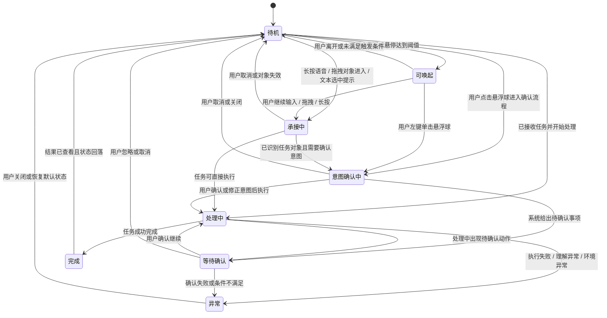
```mermaid
stateDiagram-v2
    [*] --> 待机

    待机 --> 可唤起: 用户靠近或悬停达到阈值
    待机 --> 承接中: 长按语音 / 拖拽对象进入 / 文本选中提示
    待机 --> 意图确认中: 用户点击悬浮球进入确认流程
    待机 --> 处理中: 已接收任务并开始处理

    可唤起 --> 待机: 用户离开或未满足触发条件
    可唤起 --> 承接中: 用户继续输入 / 拖拽 / 长按
    可唤起 --> 意图确认中: 用户左键单击悬浮球

    承接中 --> 意图确认中: 已识别任务对象且需要确认意图
    承接中 --> 处理中: 任务可直接执行
    承接中 --> 待机: 用户取消或对象失效

    意图确认中 --> 处理中: 用户确认或修正意图后执行
    意图确认中 --> 等待确认: 系统给出待确认事项
    意图确认中 --> 待机: 用户取消或关闭

    处理中 --> 完成: 任务成功完成
    处理中 --> 等待确认: 处理中出现待确认动作
    处理中 --> 异常: 执行失败 / 理解异常 / 环境异常

    等待确认 --> 处理中: 用户确认继续
    等待确认 --> 待机: 用户忽略或取消
    等待确认 --> 异常: 确认失败或条件不满足

    完成 --> 待机: 结果已查看且状态回落
    异常 --> 待机: 用户关闭或恢复默认状态
```

## 6.13 气泡生命周期状态图

```mermaid
stateDiagram-v2
    [*] --> 显现

    显现 --> 隐藏: 鼠标离开悬浮球区域10s
    显现 --> 置顶显现: 用户置顶
    显现 --> 已销毁: 用户删除
    显现 --> 已销毁: 气泡数量超过阈值，旧气泡被销毁

    隐藏 --> 显现: 重新唤起/再次显示
    隐藏 --> 置顶显现: 用户置顶
    隐藏 --> 已销毁: 隐藏超过5分钟
    隐藏 --> 已销毁: 用户删除

    置顶显现 --> 显现: 用户取消置顶
    置顶显现 --> 已销毁: 用户删除

    已销毁 --> [*]
```

## 6.14 语音承接状态图

```mermaid
stateDiagram-v2
    [*] --> 待机

    待机 --> 准备收音: 用户长按悬浮球
    准备收音 --> 收音中: 收音启动成功
    准备收音 --> 待机: 启动失败或用户放弃

    收音中 --> 锁定通话: 用户上滑锁定
    收音中 --> 已取消: 用户下滑取消
    收音中 --> 输入结束: 用户松开结束本轮输入

    锁定通话 --> 输入结束: 用户主动结束通话
    锁定通话 --> 已取消: 用户取消本轮语音

    输入结束 --> 理解处理中: 提交语音内容并进入理解
    理解处理中 --> 响应中: 系统开始返回结果
    理解处理中 --> 异常: 理解失败或处理失败

    响应中 --> 待机: 当前轮结束
    响应中 --> 收音中: 用户再次打断并补充需求

    已取消 --> 待机
    异常 --> 待机
```

## 6.15 意图确认状态图

```mermaid
stateDiagram-v2
    [*] --> 无任务对象

    无任务对象 --> 已识别任务对象: 文本选中 / 文本拖拽 / 文件拖拽 / 识别到协作机会
    已识别任务对象 --> 意图分析中: 用户点击悬浮球或系统进入确认流程

    意图分析中 --> 等待用户确认: 返回意图猜测与建议输出方式
    意图分析中 --> 已取消: 对象失效或用户关闭

    等待用户确认 --> 已确认: 用户接受当前意图
    等待用户确认 --> 已修正意图: 用户修改意图或输出方式
    等待用户确认 --> 已取消: 用户取消或忽略

    已修正意图 --> 已确认: 用户提交修正结果
    已修正意图 --> 已取消: 用户放弃

    已确认 --> 执行中: 发起任务执行
    执行中 --> [*]

    已取消 --> 无任务对象
```

## 6.16 前端任务状态图

```mermaid
stateDiagram-v2
    [*] --> 待发起

    待发起 --> 正在进行: 任务正式开始
    正在进行 --> 接近完成: 已完成大部分步骤
    接近完成 --> 已完成: 结果生成完成

    正在进行 --> 等待授权: 出现待授权操作
    正在进行 --> 等待补充信息: 缺少必要输入
    正在进行 --> 暂停: 用户主动暂停
    正在进行 --> 阻塞: 上游条件不满足
    正在进行 --> 失败: 执行失败
    正在进行 --> 执行异常: 运行过程异常中断

    等待授权 --> 正在进行: 用户授权通过
    等待授权 --> 已取消: 用户拒绝授权

    等待补充信息 --> 正在进行: 用户补充信息
    等待补充信息 --> 已结束未完成: 长时间未补充或流程结束

    暂停 --> 正在进行: 用户继续任务
    暂停 --> 已取消: 用户取消任务

    阻塞 --> 正在进行: 阻塞条件解除
    阻塞 --> 已结束未完成: 未恢复即结束

    失败 --> 正在进行: 用户重试或恢复
    失败 --> 已结束未完成: 放弃处理

    执行异常 --> 正在进行: 异常恢复成功
    执行异常 --> 已结束未完成: 未恢复即结束

    已完成 --> [*]
    已取消 --> [*]
    已结束未完成 --> [*]
```

---

## 7. 模块详细划分

## 7.1 前端模块

```mermaid
    flowchart TB
    
    subgraph L1[表现层]
    direction LR
    P1[悬浮球]
    P2[气泡]
    P3[轻量输入区]
    P4[仪表盘界面]
    P5[结果承接界面]
    P6[控制面板界面]
    
    P1 ~~~ P2 ~~~ P3 ~~~ P4 ~~~ P5 ~~~ P6
    end
    
    subgraph L2[应用层]
    direction LR
    A1[交互入口编排]
    A2[意图确认流程]
    A3[推荐调度]
    A4[任务发起与执行协调]
    A5[结果分发]
    
    A1 ~~~ A2 ~~~ A3 ~~~ A4 ~~~ A5
    end
    
    subgraph L3[状态管理层]
    direction LR
    S1[悬浮球状态]
    S2[气泡状态]
    S3[轻量输入状态]
    S4[当前任务对象状态]
    S5[意图确认状态]
    S6[语音状态]
    S7[仪表盘状态]
    S8[控制面板状态]
    
    S1 ~~~ S2 ~~~ S3 ~~~ S4 ~~~ S5 ~~~ S6 ~~~ S7 ~~~ S8
    end
    
    subgraph L4[服务层]
    direction LR
    V1[上下文服务]
    V2[任务服务]
    V3[推荐服务]
    V4[语音服务]
    V5[文件服务]
    V6[记忆服务]
    V7[安全服务]
    V8[设置服务]
    
    V1 ~~~ V2 ~~~ V3 ~~~ V4 ~~~ V5 ~~~ V6 ~~~ V7 ~~~ V8
    end
    
    subgraph L5[平台集成层]
    direction LR
    I1[窗口集成]
    I2[托盘集成]
    I3[快捷键集成]
    I4[文件系统集成]
    I5[拖拽集成]
    I6[通知集成]
    I7[本地存储集成]
    I8[外部能力集成]
    
    I1 ~~~ I2 ~~~ I3 ~~~ I4 ~~~ I5 ~~~ I6 ~~~ I7 ~~~ I8
    end
    
    L1 --> L2
    L2 --> L3
    L3 --> L4
    L4 --> L5
```

### 7.1.1 前端工程与桌面宿主

- Tauri 2 Windows 宿主
- 多窗口组织：悬浮球近场窗口、仪表盘窗口、控制面板窗口
- 前端多入口分包：`shell-ball`、`dashboard`、`control-panel`
- 前端应用启动、唤起、最小化、恢复、退出控制
- 托盘、通知、快捷键、更新等宿主能力接入

### 7.1.2 表现层模块

- 悬浮球控制器：拖拽、贴边、大小与透明度控制
- 气泡控制器：意图判断展示、短结果展示、生命周期管理、置顶与恢复
- 轻量输入区：一句话补充、确认/修正、附件补充、快捷动作入口
- 仪表盘界面：任务状态、便签协作、镜子模块、安全卫士、插件面板
- 结果承接界面：结果页、文档打开提示、文件结果提示、任务详情入口
- 控制面板界面：设置项配置、行为开关、记忆策略、自动化规则、成本与数据治理、密钥与模型配置

### 7.1.3 应用编排层模块

- 交互入口编排：统一处理单击、双击、长按、悬停、文本选中、文件拖拽
- 意图确认流程：对象识别后的候选意图组织、输出方式建议、修正与确认
- 推荐调度：推荐触发条件、冷却时间、用户活跃度与当前上下文判断
- 任务发起与执行协调：轻量任务、持续任务、授权等待、暂停与恢复
- 结果分发：短结果、长文档、网页结果、单文件、多文件、连续任务等多出口交付

### 7.1.4 状态管理与查询层模块

- 悬浮球状态：待机、可唤起、承接中、意图确认中、处理中、等待确认、完成、异常
- 气泡状态：数量限制、所属任务、透明化、隐藏、消散、恢复、置顶
- 轻量输入状态：输入内容、附件、提交态、禁用态
- 当前任务对象状态：文本、文件、语音上下文、悬停上下文等对象摘要与有效性
- 意图确认状态：系统猜测意图、用户修正意图、候选输出方式、确认进度
- 语音状态：收音、锁定通话、取消、打断、响应中
- 仪表盘状态与控制面板状态：当前模块、焦点区、筛选项、未保存修改
- 查询与缓存：任务列表、任务详情、记忆命中、安全待确认项、插件运行态等异步数据缓存

### 7.1.5 前端服务层模块

- 上下文服务：获取当前任务现场上下文、悬停/选中/当前界面相关输入
- 任务服务：发起任务、查询任务状态、获取任务步骤、历史任务与任务详情
- 推荐服务：推荐内容、推荐问题、候选动作请求
- 语音服务：长按语音、锁定通话、语音结果提交与回传
- 文件服务：文件解析、附件处理、结果文件查询、工作区文件打开
- 记忆服务：镜子摘要、用户画像、近期记忆命中读取
- 安全服务：待确认操作、风险等级、审计记录、恢复点与授权提交
- 设置服务：设置读取、保存、校验与默认值回填

### 7.1.6 平台集成与协议适配层模块

- Typed JSON-RPC Client：统一 method、params、result、错误模型和订阅注册
- 订阅与通知适配：run.updated、step.updated、artifact.created、plugin.updated 等事件桥接
- 窗口集成：悬浮球窗口、仪表盘窗口、控制面板窗口的打开、关闭、显隐、聚焦、置顶
- 托盘集成：托盘图标、托盘菜单、托盘级快捷入口
- 快捷键集成：全局快捷键注册、释放与冲突处理
- 拖拽集成：桌面文件拖入、原生 DragEvent 桥接、应用内拖拽协同
- 文件系统集成：打开文件、打开文件夹、高亮结果文件、读取本地文件元信息
- 本地存储集成：设置持久化、偏好缓存、面板状态记忆
- 外部能力集成：浏览器打开、剪贴板桥接和其他 Tauri 插件统一接入

## 7.2 后端接口接入层模块

### 7.2.1 JSON-RPC Server

- run/session 创建与销毁
- 实时状态推送
- 工具调用、任务更新、artifact 发布
- 订阅与通知管理

### 7.2.2 统一通信协议

- 前后端统一使用 **JSON-RPC 2.0**
- 请求 / 响应：命令式方法调用
- Notification：单向事件通知
- Subscription：运行态流式更新

### 7.2.3 协议职责

- `create_session`
- `create_run`
- `get_run`
- `subscribe_run`
- `submit_plan`
- `submit_approval`
- `cancel_run`
- `retry_run`
- `list_artifacts`
- `get_audit`
- `list_memory_hits`

## 7.3 后端 Harness 内核层模块

### 7.3.1 任务编排内核

- 任务创建
- 子步骤拆解
- 状态迁移
- 执行重试
- 人工确认转移
- 事件写入

### 7.3.2 上下文采集内核

- 当前窗口上下文
- 选中文本
- 拖入文件
- 用户授权的屏幕媒体输入
- 剪贴板
- 任务文件变化

### 7.3.3 意图识别与确认内核

- 输入归一化
- 意图分类
- 执行动作候选生成
- 前置确认信息组织
- 短链路澄清问题生成

### 7.3.4 任务状态机

- run / step 生命周期管理
- 可恢复状态推进
- 失败重试与中断处理
- 授权等待态
- 完成态与交付态归档

### 7.3.5 记忆管理内核

- 短期记忆维护
- 长期偏好存储
- 阶段总结
- 任务与记忆引用关系管理
- 记忆写入与 RAG 检索协调

### 7.3.6 结果交付内核

- 短结果回写气泡
- 长结果生成文档/文件
- 结构化结果写入 workspace
- artifact 与 citation 发布

### 7.3.7 插件系统与插件管理器

- 参考 PicoClaw 的轻量插件化实现，采用 **Manifest + 独立进程 Worker + 事件驱动回传** 的简单技术路径
- 插件进程通过 **stdio / 本地 HTTP / JSON-RPC** 与 Harness 交互，避免引入过重插件框架
- 插件注册信息、能力声明、权限边界、版本与健康状态统一纳入插件注册表
- 插件输出的运行指标、事件、结果摘要统一写入事件流，再由后端汇总为可供前端仪表盘消费的结构化数据
- 仪表盘通过订阅 `plugin.updated`、`plugin.metric.updated`、`plugin.task.updated` 等事件展示插件状态、调用次数、耗时、错误率与最近产物
- 插件系统优先满足单机可维护、低复杂度、可审计，不追求分布式插件市场能力

## 7.4 后端能力接入层模块

### 7.4.1 模型接入

- 使用 **OpenAI 官方 Responses API SDK**
- 对接标准 API，不自行实现 API 标准，也不自行维护一套独立客户端协议
- 模型切换以配置为主：模型 ID、API 端点、密钥、预算策略
- 支持 tool calling、流式结果与多轮关联
- 模型调用审计与预算治理纳入统一链路

### 7.4.2 工具执行适配器

- 文件读写
- 网页浏览与搜索
- 命令执行
- Workspace 内构建、测试、补丁生成
- 外部执行后端路由

### 7.4.3 Node Playwright Sidecar

- 浏览器自动化
- 表单填写与页面操作
- 网页抓取
- 结构化 DOM/页面结果回传

### 7.4.4 OCR / 媒体 / 视频 Worker

- Tesseract OCR
- FFmpeg 转码与抽帧
- yt-dlp 下载与元数据提取
- MediaRecorder 结果后处理

### 7.4.5 授权式屏幕 / 视频能力

- `getDisplayMedia` 发起用户授权捕获
- `MediaRecorder` 负责录制
- 本地 worker 做切片、转码、OCR 与摘要

### 7.4.6 RAG / 记忆检索层

- 记忆向量化
- 记忆候选召回
- 记忆去重
- 记忆排序
- 记忆回填摘要
- 结构化状态与语义检索解耦
- 优先采用本地存储、本地索引、本地检索闭环

## 7.5 后端治理与安全层模块

### 7.5.1 风险评估引擎

输入维度：

- 动作类型
- 目标范围
- 是否跨工作区
- 是否可逆
- 是否涉及凭据/金钱/身份
- 是否需要联网/下载/安装
- 是否需要容器执行

### 7.5.2 审计与追踪引擎

- 文件操作记录
- 网页操作记录
- 命令操作记录
- 系统动作记录
- 错误日志
- Token 日志
- 费用日志

### 7.5.3 恢复与回滚引擎

- 任务工作区级回滚
- checkpoint 恢复
- diff/sync plan 展示
- 容器执行失败后的恢复策略

### 7.5.4 成本治理引擎

- 输入/输出 Token 统计
- 模型配置与预算策略
- 降级执行
- 熔断与预算提醒

### 7.5.5 边界与策略引擎

- workspace 前缀校验
- 命令白名单
- 网络代理与外连策略
- sidecar / worker 权限边界
- 插件权限显式授权

## 7.6 后端平台与执行适配层模块

### 7.6.1 文件系统抽象层

- 路径归一化
- Workspace 边界校验
- 跨平台路径读写
- Artifact 文件落盘
- 不暴露平台专属路径实现

### 7.6.2 系统能力抽象层

- 通知
- 快捷键
- 剪贴板
- 屏幕授权
- 外部命令启动
- sidecar 生命周期管理

### 7.6.3 执行后端适配层

- Docker
- SandboxProfile
- ResourceLimit
- Remote Backend
- Windows 当前实现优先，其他平台保留接口

---

## 8. 数据架构设计

## 8.1 数据分层

1. **结构化运行态数据库（SQLite + WAL）**  
   存任务状态、步骤、待确认动作、授权结果、成本统计、事件索引。

2. **本地记忆检索与 RAG 索引层**  
   用于长期记忆、摘要、向量召回、候选过滤。优先采用本地嵌入、本地索引、本地检索方案，属于本地能力，不归入外部能力层。

3. **工作区文件系统（Workspace）**  
   存生成文档、草稿、报告、导出文件、补丁、模板。

4. **大对象存储区（Artifact）**  
   截图、录屏、可访问性树、音频、视频临时产物、关键帧，不直接塞进主状态库。

5. **机密与敏感配置区（Stronghold）**  
   密钥、模型凭证、访问令牌、敏感配置。

## 8.2 本地记忆检索实现

本地记忆与检索统一采用 **SQLite FTS5 + sqlite-vec**：

- **SQLite FTS5**：负责关键词检索、短语匹配、标题与摘要召回。
- **sqlite-vec**：负责向量存储、相似度检索与记忆候选召回。
- **混合检索策略**：先做 FTS5 与向量召回，再在 Memory 内核中完成去重、合并、排序与摘要回填。
- **数据归属**：记忆索引、向量数据、摘要数据均保存在本地，属于后端 Harness 的本地能力，不归入外部能力层。
- **运行边界**：检索写入、召回、压缩、归档都由 Memory 内核统一管理，不在业务模块内各自维护索引。

## 8.3 核心实体

- Session
- Run
- Step
- Event
- ToolCall
- Citation
- Artifact
- AgentProfile
- ContextSnapshot
- TodoItem
- RecurrenceRule
- MemorySummary
- UserProfileMemory
- MemoryCandidate
- RetrievalHit
- RiskDecision
- ApprovalRecord
- AuditLog
- Checkpoint
- TokenUsageRecord
- PluginManifest
- PluginRuntimeState
- PluginMetricSnapshot

## 8.4 关键关系

- Session 拥有多个 Run。
- Run 拥有多个 Step、Event、ToolCall、Artifact、ApprovalRecord、Checkpoint。
- TodoItem 进入执行后生成 Run，并保留 source_todo_id。
- MemorySummary、MemoryCandidate、RetrievalHit 与 Run 通过引用关系关联，不混存原始运行态。
- AuditLog 与 Run/Step/Action 强绑定，支持回放和追责。
- Citation 与 Artifact 可以附着到 Step、Event 或最终交付结果。
- AgentProfile 决定默认模型、工具开关、预算与安全策略。
- PluginManifest、PluginRuntimeState、PluginMetricSnapshot 统一归档到插件注册表与事件流，供仪表盘展示。

## 8.5 核心实体简要说明

- **Session**：一次会话级任务容器，聚合多个 run 的上下文与状态。
- **Run**：一次实际执行过程的主实体，描述任务名称、来源、状态、优先级、时间戳与整体结果。
- **Step**：Run 的子步骤实体，用于表示拆解后的执行步骤、顺序关系、状态变化与阶段结果。
- **Event**：状态与执行事件实体，用于驱动前端实时展示与审计。
- **ToolCall**：工具调用实体，记录调用目标、输入、输出、耗时、错误与权限信息。
- **Citation**：引用实体，记录回答或结果中关联的来源片段、文件、网页或上下文依据。
- **Artifact**：任务产物实体，表示生成的文档、截图、结构化结果、导出文件或中间产物。
- **AgentProfile**：Agent 的本地运行配置与能力画像，记录默认模型、工具开关、预算与策略边界。
- **ContextSnapshot**：某一次任务触发时采集到的上下文快照，包含窗口、选中文本、文件、截图、系统状态等输入。
- **TodoItem**：待办 / 巡检来源项，表示尚未正式进入执行态的事项，可被转化为 Run。
- **RecurrenceRule**：重复规则实体，描述巡检或重复任务的周期、触发条件与提醒规则。
- **MemorySummary**：任务或阶段总结后的记忆摘要，用于后续检索、复用与上下文压缩。
- **MemoryCandidate**：记忆候选实体，用于表示召回后待过滤、待排序的记忆片段。
- **RetrievalHit**：RAG 检索命中实体，表示本次任务命中的记忆索引结果及分数。
- **UserProfileMemory**：用户长期偏好与协作画像实体，用于保存偏好、习惯、工作方式等长期记忆。
- **RiskDecision**：风险评估结果实体，记录本次动作的风险等级、命中规则、影响范围与建议处理方式。
- **ApprovalRecord**：授权记录实体，保存用户对高风险动作的确认、拒绝、授权范围与时间。
- **AuditLog**：审计日志实体，记录文件、网页、命令、系统动作等关键行为，便于追踪与回放。
- **Checkpoint**：恢复点实体，表示任务执行前后的可回滚节点，用于失败恢复与用户中断回退。
- **TokenUsageRecord**：模型调用计量实体，记录输入/输出 Token、模型类型、成本与时间，用于预算治理。
- **PluginManifest**：插件声明实体，记录插件名称、版本、入口、能力范围、权限与展示元数据。
- **PluginRuntimeState**：插件运行态实体，记录健康状态、最近心跳、当前任务、最近错误与实例信息。
- **PluginMetricSnapshot**：插件指标快照实体，记录调用次数、耗时、错误率、产物数量等统计信息。

---

## 9. 技术选型（统一版）

## 9.1 总体技术栈

### 前端桌面壳与应用

- **桌面壳：Tauri 2（当前仅 Windows 落地）**
- **前端框架：React 18**
- **语言：TypeScript**
- **构建工具：Vite**
- **样式体系：Tailwind CSS**
- **无样式交互原语：Radix UI**
- **基础组件资产：shadcn/ui**
- **锚点与浮层定位：Floating UI**
- **图标体系：lucide-react**
- **动效层：Motion**

### 前端状态与数据访问

- **本地交互状态：Zustand**
- **异步查询与缓存：TanStack Query**
- **运行时 schema 校验：zod**
- **统一协议调用：Typed JSON-RPC Client**

### 前端交互与桌面集成

- **桌面文件拖入：原生 DragEvent + Tauri 文件能力**
- **应用内拖拽：dnd-kit（仅在需要复杂拖拽时引入）**
- **手势与长按：Pointer Events 主实现**
- **桌面能力：Tauri 官方插件（Tray / Notification / Global Shortcut / Clipboard / Updater / Store）**

### 主业务后端 Harness

- **Go 1.26 local service / harness service**

### 前后端通信

- **JSON-RPC 2.0**
- 传输层可跑在 localhost HTTP / WebSocket 之上
- Notification / Subscription 用于实时状态更新
- 前端应用资源继续走 Tauri 默认应用协议，不使用 localhost 托管整个 UI

### 结构化存储

- **SQLite + WAL**
- **数据库连接由 Go service 持有**

### 记忆与检索

- **本地 RAG（语义检索层）**
- **SQLite FTS5 + sqlite-vec**
- 支持长期记忆召回、候选过滤、摘要回填
- 由 Memory 层统一管理，避免和结构化运行态耦合

### 密钥与敏感配置

- **Tauri Stronghold**

### 浏览器自动化

- **Node.js sidecar + 官方 Playwright**

### 屏幕 / 视频能力

- **getDisplayMedia + MediaRecorder + FFmpeg + yt-dlp + Tesseract**

### 插件系统

- **Manifest + 独立进程 Worker + stdio / 本地 HTTP / JSON-RPC**

### LLM / AI 服务

- **OpenAI 官方 Responses API SDK**
- 通过标准 API 接入
- 模型切换主要通过模型 ID 与端点配置完成

### 沙盒与执行隔离

- **Docker 外部执行后端**
- **宿主只负责 workspace 边界校验、命令白名单、网络代理与策略控制**

### 安装与分发

- **Windows**：Tauri 打包安装程序
- 当前阶段不实现 Linux / macOS 的安装包、分发与交付链路

## 9.2 选型理由

### 9.2.1 Tauri 2 + React 18 + TypeScript + Vite

这套组合符合“桌面宿主 + 多入口前端 + 本地 Harness Service”的目标：

- Tauri 适合承载悬浮球、仪表盘、控制面板等多窗口桌面壳
- React 18 适合多承接层 UI 和状态驱动交互
- TypeScript 有利于统一任务状态、事件协议、结果结构
- Vite 适合多入口构建和快速迭代

### 9.2.2 Tailwind CSS + Radix UI + shadcn/ui + Floating UI

前端核心不是后台表格页面，而是近场轻交互系统：

- Tailwind 适合高频试错与轻量主题组织
- Radix 适合构建无样式交互原语，保证行为一致性
- shadcn/ui 适合沉淀基础组件资产，降低页面和弹层的重复开发成本
- Floating UI 适合锚点定位、浮层碰撞处理、悬浮球附近气泡与轻量输入布局

### 9.2.3 Motion

动画层只服务于状态表达：

- 悬浮球待机、可唤起、处理中、完成态切换
- 气泡显现、隐藏、消散与恢复
- 拖拽吸附反馈
- 语音状态变化

### 9.2.4 Zustand + TanStack Query + zod

前端状态分治对该产品尤为重要：

- Zustand 负责悬浮球、气泡、语音、意图确认、控制面板等本地交互态
- TanStack Query 负责任务列表、任务详情、安全记录、记忆命中、插件运行态等异步数据
- zod 负责运行时 schema 校验，保证前后端协议对象进入前端状态前完成收敛

### 9.2.5 Typed JSON-RPC Client

统一协议调用层是前端工程秩序的基础：

- 把 method、params、result、错误结构与订阅注册统一收口
- 避免组件内部散落 invoke、fetch 与临时协议拼装
- 便于多入口窗口共享同一套调用能力与类型定义
- 与后端 JSON-RPC 边界严格对齐

### 9.2.6 Pointer Events + 原生 DragEvent + Tauri 文件能力

交互核心依赖长按、上滑、下滑、悬停和桌面文件拖入：

- Pointer Events 适合作为长按和手势的统一底层
- 原生 DragEvent 更适合桌面文件拖入和外部对象接入
- Tauri 文件能力负责桌面文件桥接与本地路径访问
- dnd-kit 仅在应用内部需要复杂拖拽排序时再引入

### 9.2.7 JSON-RPC 2.0

这套协议更适合当前 CialloClaw 的前后端分离架构：

- 前后端边界稳定，后端只暴露方法、通知和订阅
- Go / TypeScript / Node 之间接入成本低
- 请求、响应、通知、订阅结构统一
- 更适合 AI 编码时代的统一 schema 驱动开发
- 便于 sidecar / worker / plugin 与主服务保持同一协议风格

### 9.2.8 Go 1.26 local service / harness service

Go 继续负责任务编排、状态机、SQLite、worker 调度、审计和恢复，但不承担前端桌面壳职责。这样可以保留 Go 在本地服务与高并发调度上的优势，同时避免 UI 技术路线被 Go 原生桌面壳绑定。

### 9.2.9 SQLite + WAL + 本地 RAG

- **SQLite** 负责结构化运行态、事务和审计
- **FTS5 + sqlite-vec** 负责本地长期记忆与语义检索
- 两者分工清晰，部署轻，适合单机 Windows 版本优先落地
- 后续若召回规模扩大，可在不改动上层 Memory 内核的前提下演进本地检索实现

### 9.2.10 Stronghold

密钥、模型 Token、敏感配置由 Tauri Stronghold 管理，避免把敏感信息直接散落在本地明文文件或业务数据库里。

### 9.2.11 Node Playwright Sidecar

浏览器自动化不走 Go 原生封装主路径，而是使用 Playwright 官方支持最成熟的 Node / TypeScript 路线，更适合复杂网页自动化和长期维护。

### 9.2.12 OpenAI 官方 Responses API SDK

当前直接对接标准 API，优先使用 OpenAI 官方 SDK：

- 无需自行实现 API 标准
- 支持 tool calling
- 支持流式返回
- 支持多轮状态关联
- 更适合当前 Agent 场景

模型切换主要通过模型 ID、API 端点与配置切换完成，不额外引入重量级 Provider 抽象层。

### 9.2.13 轻量插件系统

插件系统参考 PicoClaw 的轻量实现思路：

- 插件作为独立进程 Worker，隔离性更强
- 通过 Manifest 声明能力、权限、入口与展示信息
- 通过 stdio / 本地 HTTP / JSON-RPC 与 Harness 对接，技术复杂度低
- 插件运行数据天然可事件化，便于前端仪表盘展示

### 9.2.14 Docker 沙盒

宿主只负责轻治理，真正的强隔离交给 Docker 沙盒执行。

## 9.3 明确不建议的技术路线

- 不采用 Wails 作为桌面壳主路线
- 不采用 Go 原生桌面插件桥接作为公共能力主路线
- 不把整个前端 UI 用 localhost 托管
- 不把 go-plugin 继续作为核心插件体系
- 不把屏幕感知主链路建立在 Win32 原生桥接上
- 不把 Windows 原生轻沙盒作为核心隔离能力
- 不让任何成员自己定义一套“AI 生成出来就算数”的目录和命名
- 不让模型接入直接散落在业务逻辑中

---

## 10. 执行隔离与部署架构

## 10.1 执行隔离分层

### 10.1.1 宿主治理层

适用于：

- workspace 边界校验
- 命令白名单
- 网络代理
- sidecar / worker / plugin 启停
- 风险提示与授权确认

### 10.1.2 外部执行后端层

适用于真正高风险任务：

- Docker
- 未来可扩展的远程执行后端

## 10.2 部署原则

- 当前仅交付 Windows 安装包与 Windows 运行闭环。
- 安装后即可使用基础能力，不强依赖 Docker，但高风险能力通过 Docker 沙盒执行。
- 前端资源使用 Tauri 默认应用协议。
- Go service 作为 sidecar 随应用一起分发。
- Node Playwright sidecar 与媒体 worker 独立分发和升级。
- Updater 必须使用签名校验的更新链路。
- Linux / macOS 暂不实现部署、安装和分发，但相关底层抽象必须保留，避免未来重构主链路。

---

## 11. 可观测与成本治理

## 11.1 观测指标

应把以下做成一等指标：

- 每次调用输入/输出 Token
- 各上下文块占比
- 哪类工具导致膨胀
- 哪类任务单位成本最高
- 摘要压缩节省率
- 缓存命中率
- 降级触发率
- 重试率
- worker / sidecar / plugin 失败率
- 容器执行成功率
- RAG 命中率
- 记忆候选过滤命中率
- 插件调用次数、耗时、错误率、心跳状态

## 11.2 成本控制策略

- 上下文预算前置分配
- 历史上下文采用摘要继承，不滚动原文
- 工具结果默认回填摘要而不是全文
- 小模型 / 规则预处理，大模型做推理和生成
- 输出长度预算
- 长任务阶段性压缩
- 触发成本熔断与自动降级

---

## 12. 非功能设计

### 12.1 性能

- 悬浮球常驻必须轻量
- 主动协助默认低频、不强弹窗
- 大对象不进主状态库
- 高频状态变化用事件总线与增量更新
- Windows 当前版本交互延迟优先稳定

### 12.2 可靠性

- 关键步骤 checkpoint
- 原子写入
- workspace 内临时文件 + rename
- 执行中断后可见已完成 / 未完成 / 可恢复 / 需回滚状态
- sidecar / worker / plugin 崩溃后可重连、可回收、可降级

### 12.3 安全性

- workspace prefix check
- 工作区越界阻断
- 高风险动作必须确认
- 容器执行优先
- 审计全链路留痕
- 插件权限显式授权
- 更新包签名校验

---

## 13. 结论

CialloClaw 的正确架构方向，不是“Go 原生桌面壳 + 一堆工具”，而是：

**Tauri 2 桌面宿主 + React 18 前端 + JSON-RPC 2.0 边界 + Go 1.26 Harness Service + OpenAI 官方 Responses API SDK + SQLite + 本地 RAG + Stronghold + 外部 worker / sidecar / plugin + 容器优先执行后端 + 严格协作规范 + Windows 优先、跨平台抽象预留。**

因此，CialloClaw 更适合被定义为：

**一个以前后端分离为基本架构、以 Tauri 2 为 Windows 桌面宿主、以 React 18 + TypeScript + Vite 为前端、以 Go 1.26 Harness Service 为主业务后端、以 JSON-RPC 2.0 为唯一前后端通信边界、以 SQLite + 本地 RAG 为数据基础的轻量桌面协作 Agent。**
