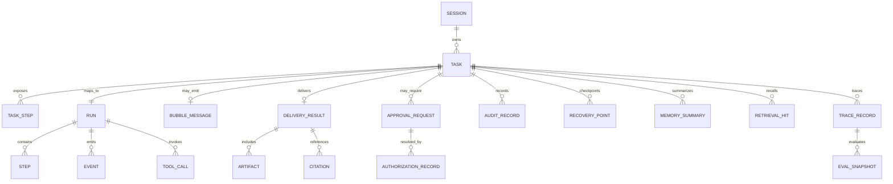
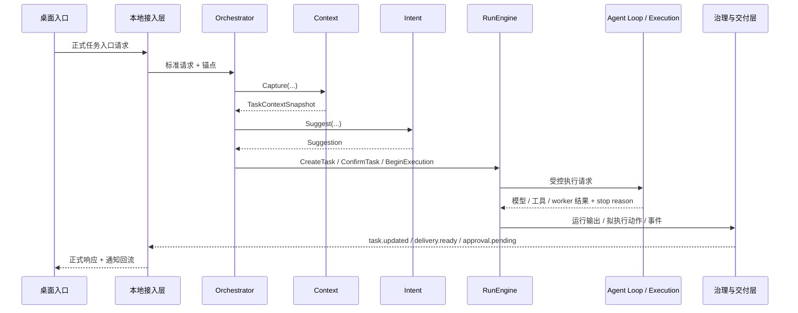
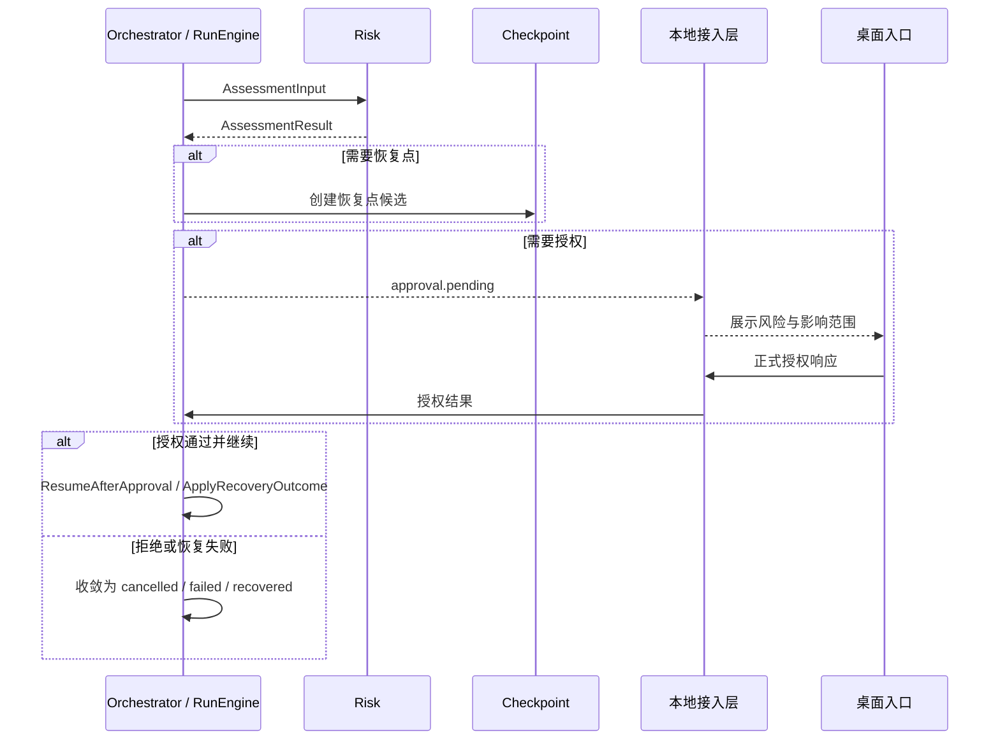
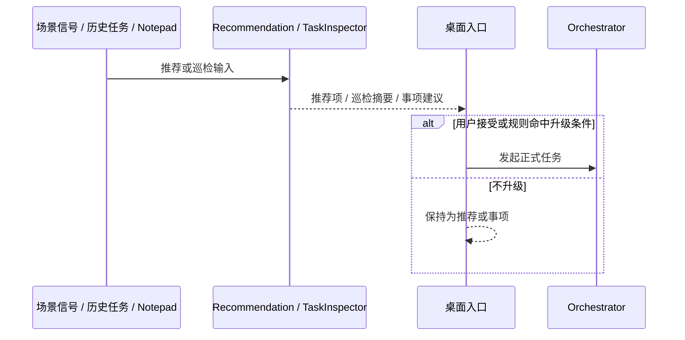

# CialloClaw 架构总览文档

## 1. 文档定位与边界

### 1.1 文档目的

本文档定义 CialloClaw 当前阶段的架构总览基线，用于统一以下认知：

- 系统的产品边界、运行边界和工程边界是什么。
- 系统采用什么逻辑分层，各层之间通过什么正式对象和回流协作。
- 主任务链如何从桌面现场进入本地 Harness，并经过编排、执行、治理、交付和恢复。
- 哪些对象属于对外正式对象，哪些对象属于执行兼容对象，哪些结构只用于短生命周期运行时协调。
- 当前架构在性能、可靠性、安全治理、可观测性、可扩展性和可维护性上的总体策略是什么。

本文档是 overview，只回答系统级分层、对象边界和主链问题，不承担协议真源、数据真源、模块详细设计或产品交互说明的职责。

### 1.2 覆盖范围

本文档覆盖当前仓库中已经进入正式主链或直接支撑正式主链的部分，包括：

- `apps/desktop`：桌面宿主、多入口前端、近场承接、仪表盘与控制面板。
- `services/local-service`：本地 Harness 中的 `rpc`、`orchestrator`、`context`、`intent`、`runengine`、`agentloop`、`delivery`、`risk`、`memory`、`audit`、`checkpoint`、`traceeval`、`recommendation`、`taskinspector`、`execution`、`model`、`tools`、`plugin`、`storage`、`platform`、`perception`。
- `workers/*`：Playwright、OCR、媒体处理等 sidecar worker。
- `packages/protocol`：正式协议对象、方法族、通知、共享 schema 与错误码口径。
- `/docs` 中与架构、协议、数据、模块和开发规则直接相关的真源文档。

### 1.3 不在本文档展开的内容

以下内容不在本文档中展开：

- 页面级交互、视觉样式、组件状态机和产品文案。
- JSON-RPC 方法字段、通知字段、错误码枚举和 schema 细节。
- 表结构、索引、DDL、迁移脚本、序列化格式和文件落盘细节。
- 模块内部类图、函数签名、Prompt 细节、工具参数模板与代码级实现。
- 测试策略、提交规范、排期执行方式和工程治理流程。

这些内容分别由 `docs/protocol-design.md`、`docs/data-design.md`、`docs/module-design.md`、`docs/development-guidelines.md` 和 `docs/work-priority-plan.md` 承接。

## 2. 系统定位与设计目标

### 2.1 系统定位

CialloClaw 当前是一个 **Windows 优先、本地优先、以 `task` 为对外主对象组织系统** 的桌面协作 Agent 工程。

从当前代码和文档基线看，它不是一个以聊天窗口为中心的通用 AI 客户端，而是一个由以下三部分组成的本地协作系统：

1. **桌面入口前端**：承接 `shell-ball` 近场入口、轻量输入、仪表盘、控制面板和状态投影，使任务能够在当前现场直接发起。
2. **本地 Harness 服务**：以 Go `local-service` 作为唯一稳定的业务中枢，统一负责 JSON-RPC 接入、任务编排、运行控制、治理闭环、结果交付、查询装配与通知回流。
3. **本地能力与持久化支撑**：通过模型适配、工具路由、插件运行态、执行后端、sidecar worker、SQLite、Workspace、Artifact 和机密存储提供实际执行与持久化能力。

因此，CialloClaw 的系统定位可以概括为：

- **产品上**：围绕桌面现场和持续任务，而不是围绕聊天轮次。
- **运行上**：对外以 `task` 组织，对内保留 `run / step / event / tool_call` 兼容执行链。
- **工程上**：由桌面入口、本地接入、Harness 编排、治理交付、能力适配和本地持久化共同构成。

### 2.2 架构要解决的问题

当前架构主要面向以下问题空间：

1. **现场承接**：输入来源可能是选区、页面、报错、文件拖拽、便签事项、推荐提示或仪表盘动作，系统必须直接接住现场，而不是要求用户先切换到聊天页补上下文。
2. **任务推进**：系统必须围绕 `task` 组织状态、授权、交付和详情，而不是围绕一轮轮聊天消息组织状态。
3. **执行治理**：文件写入、命令执行、网页交互、依赖安装和工作区外访问等动作必须被风险评估、授权、审计和恢复点保护约束。
4. **结果交付**：系统必须同时支持轻量反馈、正式交付、结构化产物、引用、任务详情刷新和安全摘要。
5. **长期协作**：系统需要记忆、推荐、巡检、待办升级和 Trace / Eval 能力，但这些能力不能污染任务主状态机与正式业务真源。

### 2.3 设计目标

当前架构以以下目标为准：

- 建立以 `task` 为核心对象的统一主链路。
- 保持 `task-centric` 对外语义与 `run-centric` 执行兼容链的稳定映射。
- 让本地 Harness 持有主状态机，模型与工具能力只能通过受控执行分支进入。
- 让风险、授权、交付、审计、恢复、记忆和预算治理成为主链的一部分，而不是外围附属。
- 让桌面入口、本地接入、任务处理、治理交付、能力适配与持久化边界清晰、可验证、可演进。

## 3. 架构原则

当前架构遵循以下原则：

- **任务中心**：`task` 是对外主对象，前端视图、正式交付和安全摘要统一围绕它组织。
- **本地优先**：优先在本地完成编排、治理、持久化、索引与恢复。
- **分层清晰**：入口层不做主状态机推进，接入层不做业务决策，能力层不承载产品语义。
- **治理内建**：风险、授权、审计、恢复、Trace / Eval 和预算治理必须能影响主链路。
- **统一出口**：正式结果统一通过 `bubble_message / delivery_result / artifact / citation` 等正式对象回流。
- **正式与兼容分层**：对外围绕 `task`，对内保留 `run / step / event / tool_call` 作为执行与排障兼容链。
- **记忆与运行态分层**：长期记忆、巡检、推荐、Trace / Eval 不能直接替代任务主状态机或正式业务真源。

## 4. 总体架构

### 4.1 总体分层图

```mermaid
flowchart TB
    subgraph L1[桌面入口层]
        direction TB
        E1[shell-ball / 近场入口]
        E2[dashboard / 任务工作台]
        E3[control-panel / 设置与授权入口]
        E4[现场采集与状态投影]
    end

    subgraph L2[本地接入层]
        direction TB
        A1[JSON-RPC 接入]
        A2[对象锚定与查询装配]
        A3[通知回流]
    end

    subgraph L3[任务处理层]
        direction TB
        T1[Orchestrator]
        T2[Context / Intent]
        T3[RunEngine]
        T4[Agent Loop / 会话串行 / 人工控制]
        T5[Recommendation / TaskInspector]
    end

    subgraph L4[治理与交付层]
        direction TB
        G1[Risk / Approval]
        G2[Delivery]
        G3[Memory / Audit / Trace / Eval]
        G4[Checkpoint / Recovery]
    end

    subgraph L5[存储与能力层]
        direction TB
        C1[Storage / SQLite / 索引]
        C2[Model / Tools / Plugin]
        C3[Execution / Worker / Platform / Workspace]
    end

    E1 --> E4
    E2 --> E4
    E3 --> E4
    E4 --> A1 --> A2 --> T1
    T1 --> T2 --> T3 --> T4
    T5 --> T1
    T3 --> G1
    T3 --> G2
    T4 --> C2 --> C3
    G1 --> G3
    G2 --> G3
    G2 --> G4
    G2 --> C1
    G3 --> C1
    G4 --> C1

    G1 -. approval.pending / 授权结果 .-> A3
    G2 -. task.updated / delivery.ready .-> A3
    G3 -. 运行事件 / 安全摘要 / trace 回流 .-> A3
    G4 -. recovery 结果 / 续跑信号 .-> A3
    A3 -. 统一视图投影 .-> E4
    G4 -. 恢复续跑 .-> T3
```

### 4.2 主执行链与反馈链

上图同时表达两类关系：

- **实线**表示主执行链。请求从桌面入口进入本地接入层，再进入任务处理层完成编排与执行，随后进入治理与交付，最终落到存储与能力层。
- **虚线**表示正式反馈链。它们不是新的业务主链，而是把授权请求、运行事件、正式结果和恢复结果回流到接入层和前端。

当前正式反馈链至少包括以下对象或事件族：

| 反馈类型 | 典型对象或事件 | 作用 |
| --- | --- | --- |
| 授权回流 | `approval.pending`、授权结果 | 把待确认动作和确认结果回到正式主链 |
| 结果回流 | `delivery.ready`、`DeliveryResult`、`Artifact`、`Citation` | 把正式交付与引用链回到消费层 |
| 状态回流 | `task.updated`、`loop.*`、`task.steered`、`tool_call.completed` | 让任务状态和运行进度持续可见 |
| 会话回流 | `task.session_queued`、`task.session_resumed` | 反映同会话串行与恢复执行 |
| 恢复回流 | `RecoveryPoint`、恢复结果、resume 信号 | 把恢复结果并回正式主链 |

### 4.3 分层职责总览

| 层级 | 负责内容 | 典型边界 |
| --- | --- | --- |
| 桌面入口层 | 入口触发、现场采集、轻反馈、任务查看和设置入口 | 不做主状态机推进，不直连数据库、模型、worker |
| 本地接入层 | 方法路由、对象锚定、响应封装、通知重放与查询装配 | 不做任务规划和风险决策 |
| 任务处理层 | 编排、上下文捕获、意图建议、状态推进、Agent Loop、会话串行、推荐与巡检升级 | 是唯一正式任务中枢 |
| 治理与交付层 | 风险判断、审批承接、正式交付、审计、恢复、记忆、Trace / Eval | 不新建业务任务，不取代编排器 |
| 存储与能力层 | 正式对象存储、索引、模型/工具/插件适配、执行与隔离 | 不拥有产品语义，不越层面向前端 |

## 5. 核心对象与分层关系

### 5.1 正式对象与执行兼容对象

当前架构中的对象应按以下方式理解：

| 对象层次 | 代表对象 | 作用 |
| --- | --- | --- |
| 对外正式对象 | `Task`、`TaskStep`、`BubbleMessage`、`DeliveryResult`、`Artifact`、`ApprovalRequest`、`AuthorizationRecord`、`AuditRecord`、`RecoveryPoint`、`MirrorReference` | 面向前端、协议和正式交付的对象 |
| 执行兼容对象 | `Run`、`Step`、`Event`、`ToolCall`、`Citation` | 面向执行、排障、回放和运行时事件的兼容表达 |
| 长期协作与评估对象 | `MemorySummary`、`MemoryCandidate`、`RetrievalHit`、`TraceRecord`、`EvalSnapshot` | 支撑记忆、召回、追踪和评估 |
| 运行时协调结构 | `TaskContextSnapshot`、`intent.Suggestion`、`runengine.TaskRecord`、待执行计划等 | 只服务于当前实现中的编排与状态推进，不构成新的协议真源 |

### 5.2 对象关系图



### 5.3 状态分层原则

当前系统中的状态必须按以下原则理解：

- 对外产品态统一以 `task.status` 为主。
- `run / step / event / tool_call` 的状态语义只服务于执行兼容链，不直接替代 `task.status`。
- 悬浮球、气泡、轻量输入、窗口可见性、面板开关等都属于前端局部状态，不构成正式业务状态。
- 授权等待、暂停、阻塞、失败、恢复等都必须通过正式对象或正式状态体现，而不是只停留在文案或日志中。

### 5.4 真源分层原则

当前架构中的真源至少分为以下四层：

- **任务与交付真源**：围绕任务主对象、任务阶段和正式交付组织。
- **执行兼容真源**：围绕运行实例、执行步骤、运行事件和工具调用组织。
- **治理真源**：围绕授权、审计和恢复对象组织。
- **长期协作与评估真源**：围绕记忆、追踪和评估对象组织。

这些分层的核心目标是：

- 前端消费围绕 `task` 与正式交付对象。
- 执行兼容对象用于运行控制、排障和回放。
- 治理与记忆对象不能侵入运行态主状态机。

## 6. 逻辑分层与协作边界

### 6.1 桌面入口层

桌面入口层负责承接语音、悬停输入、文本选中、文件拖拽、仪表盘查看和控制面板动作，并把正式对象以低打扰方式回显给用户。

关键边界：

- 只承接交互与展示，不拥有正式执行真源。
- 不直接触达数据库、模型、工具、worker、plugin 或执行后端。
- 局部状态不能覆盖 `task.status`、`approval_request.status` 等正式状态。

### 6.2 本地接入层

本地接入层是前后端之间唯一稳定边界，当前以 JSON-RPC 2.0 为主，Windows 下以 Named Pipe 为正式主承诺，并保留调试态 HTTP / SSE 兼容链路。

关键边界：

- 只做协议承接、对象锚定、查询装配和通知回流。
- 不承担任务规划、风险判断和执行控制。
- 不允许把通知退化为隐藏命令通道。

### 6.3 任务处理层

任务处理层负责把请求组织成正式 `task` 主链路输入，完成上下文捕获、意图建议、任务创建、状态推进、Agent Loop 运行、会话串行、人工 steer / pause / resume / cancel，以及推荐与巡检升级。

关键边界：

- 是唯一正式任务中枢。
- 对外围绕 `task`，对内保留 `run / step / event / tool_call` 执行兼容链。
- worker、plugin、sidecar 和前端入口都不能自持 `task / run` 状态机。

### 6.4 治理与交付层

治理与交付层负责围绕任务执行结果构造风险判断、审批对象、正式结果、记忆对象、审计记录、恢复点和恢复结果。

关键边界：

- 高风险动作必须先进入风险、授权、审计和恢复点链路。
- 正式结果统一通过 `BubbleMessage / DeliveryResult / Artifact / Citation` 回流。
- Trace / Eval、记忆、审计和恢复都必须与 `task / run` 稳定关联。

### 6.5 存储与能力层

存储与能力层负责正式对象持久化、本地索引、模型适配、工具路由、插件运行态、执行后端、sidecar worker、Workspace、Artifact 和 Path Policy。

关键边界：

- 只能通过适配器暴露能力，不直接拥有产品语义。
- 数据仓库是正式真源读写的唯一收口层，不允许业务层、前端或 worker 绕过它直写。
- Workspace 文件落盘不等于任务完成，执行成功也不等于正式结果已交付。

## 7. 核心链路

### 7.1 标准任务链路



该链路强调：

- 先有正式 `task`，再进入执行。
- `context` 与 `intent` 负责捕获和建议，不掌握主状态机。
- RunEngine 是状态推进点；Agent Loop / Execution 是受控执行分支。
- 正式结果和治理对象必须经由治理与接入层回流。

### 7.2 授权与恢复链路



### 7.3 会话串行、任务续接与人工控制

当前系统需要同时处理两类运行控制：

- **会话串行**：同一 `session` 下的主动执行分支需要被统一协调，必要时进入 `task.session_queued / task.session_resumed` 链路。
- **任务续接与 steer**：后续补充输入、显式 `task.steer`、pause / resume / cancel 都必须并入正式任务链，而不是靠前端局部状态补丁式拼接。

这一点在当前主线实现上尤其重要，因为：

- 近场任务入口已经统一收口到正式任务入口族。
- `task.steered` 与 `loop.*` 已经是正式反馈链的一部分。
- continuation routing 已经进入编排层，而不是由前端或 worker 私下决定。

### 7.4 推荐与巡检升级链路

推荐与巡检默认不直接进入任务主状态机。只有在用户接受、规则命中或明确升级动作发生后，才进入正式任务链。



### 7.5 受控视觉任务链路

当前代码与协议已经形成了视觉型任务的正式主链口径：

- 页面、窗口、屏幕、可见文本、停留与切换信号统一作为正式输入上下文的一部分进入主任务入口。
- 受控视觉任务沿既有 `task -> approval_request -> event -> artifact / delivery_result` 链路执行。
- 屏幕证据、OCR 摘要、引用片段和审计信息继续通过 `Artifact / Citation / DeliveryResult / AuditRecord / RecoveryPoint` 回流，而不是由 worker 原始输出越层直出。

## 8. 非功能需求

### 8.1 性能与响应

- 近场入口到任务创建必须保持轻量。
- 高延迟模型、工具和 worker 调用应通过异步状态推进回流阶段结果。
- 结果交付应区分 `bubble_message` 与 `delivery_result / artifact`，避免所有结果都等待完整产物落地后才可见。

### 8.2 可靠性与可恢复性

- `task` 与 `run` 必须稳定映射。
- 高风险动作前应优先具备恢复点或明确不可恢复说明。
- 中断、取消、授权拒绝、恢复失败、会话排队和人工暂停都必须有明确收敛路径。

### 8.3 安全与治理

- 文件写入、命令执行、工作区外访问、依赖安装、敏感路径访问和页面交互等高风险动作必须进入风险评估链。
- 风险判断、审批承接、授权记录、审计留痕和恢复点必须保持对象化。
- Workspace / Path Policy / Secret Store 必须与普通设置、普通状态和普通文件路径严格分层。

### 8.4 可观测性与排障

- 任务详情需要围绕正式对象和运行时投影构建，而不是依赖单一兼容快照字段。
- `events`、`tool_calls`、`trace_records`、`eval_snapshots` 需要与 `task / run / step` 形成稳定引用关系。
- 正式通知链必须支撑任务列表、详情、安全摘要和调试视图的统一刷新。

### 8.5 可扩展性

- 新入口形态应扩展桌面入口层，而不直接侵入 RunEngine 或仓储语义。
- 新能力接入应通过模型 / 工具 / 插件 / worker 适配层暴露，而不直接散布到底层 provider SDK。
- 新治理能力应优先并入正式对象链和正式通知链，而不是在外围再造一套回流机制。

### 8.6 可维护性与文档协同

- 架构总览解释系统边界、分层和主链，不承载协议字段、模块输出格式和产品交互细节。
- 协议字段与方法口径以 `docs/protocol-design.md` 为准。
- 数据模型与落表边界以 `docs/data-design.md` 为准。
- 模块职责、时序和联调细节以 `docs/module-design.md` 为准。
- 工程规则与统一约束以 `docs/development-guidelines.md` 为准。

## 9. 附录 A：架构到实现的映射

这一附录只提供“架构层到当前代码布局”的概要映射，用于帮助读者把架构层理解投影回仓库，不承担详细实现设计职责。

| 架构角色 | 当前实现锚点 |
| --- | --- |
| 桌面入口层 | `apps/desktop/src/features/shell-ball`、`dashboard`、`control-panel` |
| 本地接入层 | `services/local-service/internal/rpc` |
| 任务编排器 | `services/local-service/internal/orchestrator` |
| 上下文与意图 | `services/local-service/internal/context`、`intent` |
| 运行控制 | `services/local-service/internal/runengine`、`agentloop` |
| 推荐与巡检 | `services/local-service/internal/recommendation`、`taskinspector` |
| 治理与交付 | `services/local-service/internal/risk`、`delivery`、`memory`、`audit`、`checkpoint`、`traceeval` |
| 存储与能力层 | `services/local-service/internal/storage`、`model`、`tools`、`plugin`、`execution`、`platform`、`perception` |
| sidecar worker | `workers/playwright-worker`、`workers/ocr-worker`、`workers/media-worker` |
| 协议真源 | `packages/protocol` |

附录中的目录映射只用于说明“当前代码大致落在哪些层”，不用于冻结模块内部实现方式或目录细分规则。
