# CialloClaw 架构设计文档

## 1. 文档目的与范围

### 1.1 文档目的

本文档定义 CialloClaw 当前阶段的正式架构基线，用于架构评审、研发对齐、详细设计分解和后续实现回写。本文档重点回答以下问题：

- 当前系统在产品形态、运行形态和工程形态上的正式边界是什么。
- 系统如何分层，层与层之间通过什么对象协作，哪些反馈链是正式主链的一部分。
- 任务如何从桌面现场进入本地服务，并被编排、执行、治理、交付和恢复。
- 哪些对象是主状态机对象，哪些对象是治理与交付对象，哪些对象属于短生命周期运行态对象。
- 在性能、可靠性、安全治理、可观测性、可扩展性和可维护性方面，系统采用什么架构策略。

本文档定位为“架构设计文档”，用于指导协议设计、数据设计、模块详细设计和实现分工，但不替代这些下游文档。

### 1.2 文档覆盖范围

本文档覆盖当前仓库中已经参与主任务闭环的正式模块边界，具体包括：

- `apps/desktop`：多入口桌面前端及其 `shell-ball`、`dashboard`、`control-panel` 等入口在架构中的职责划分。
- `services/local-service`：本地 Harness 服务中的 `rpc`、`orchestrator`、`context`、`intent`、`runengine`、`agentloop`、`delivery`、`risk`、`memory`、`audit`、`checkpoint`、`recommendation`、`taskinspector`、`model`、`tools`、`plugin`、`execution`、`storage`、`platform` 等模块。
- `workers/*`：Playwright、OCR、媒体处理等 sidecar worker 与本地服务之间的协作边界。
- `packages/protocol`：对外协议对象、方法口径和内部对象之间的映射边界。
- `/docs` 主集中与上述模块直接相关的架构、协议、数据和模块说明文档。

### 1.3 非目标

本文档不展开以下内容：

- 页面级交互细节、状态动效、按钮行为、产品文案与交互稿。
- JSON-RPC 方法级字段定义、错误码、通知事件字段约定。
- 表结构、索引、文件布局、DDL、迁移脚本与存储序列化细节。
- 模块内部类图、方法签名、Prompt 细节、工具参数模板与代码级实现。
- Linter、CI、提交规范、测试策略、技能资产管理、蓝图模板等工程规范内容。

上述内容应分别下沉到产品交互设计、协议设计、数据设计、模块详细设计和开发规范文档。

## 2. 系统定位、问题空间与设计目标

### 2.1 系统定位

CialloClaw 当前是一个 **面向 Windows 优先落地、以本地 Harness 为中枢、以 `task` 为主对象组织系统** 的桌面协作 Agent 工程。

从当前仓库实现看，它不是一个以聊天窗口为中心的通用 AI 客户端，而是由三部分共同组成的本地协作系统：

1. **桌面端多入口前端**：以桌面宿主承接 `shell-ball`、`dashboard`、`control-panel` 等入口，让任务可以在当前桌面现场直接发起，也让授权、状态和结果能以轻打扰方式回到用户当前工作流。
2. **本地 Harness 服务**：以 Go `local-service` 作为前后端之间唯一稳定的业务中枢，统一负责 JSON-RPC 接入、对象绑定、任务编排、运行控制、治理闭环、结果交付与通知回流。
3. **本地能力与执行后端**：通过 `model`、`tools`、`plugin`、`execution`、`storage`、`platform` 以及 `workers/*` sidecar worker 提供模型调用、工具路由、浏览器自动化、OCR、媒体处理、工作区文件与持久化能力。

因此，CialloClaw 的系统定位可以归纳为三点：

- **产品上**，它是围绕桌面现场工作的协作 Agent，而不是单一聊天窗体。
- **运行上**，它以 `task` 为对外主对象，以 `run / step / event / tool_call` 为内部执行兼容对象组织状态和追踪。
- **工程上**，它是一个由前端入口、本地服务、治理闭环、能力适配、sidecar worker 和本地存储共同组成的分层系统，而不是单体聊天应用。

### 2.2 问题空间

CialloClaw 需要解决的不是“用户如何和模型多聊几轮”，而是“用户如何在当前桌面现场直接发起协作，并让系统以可控、可恢复、可追踪的方式完成任务”。

这要求架构同时处理以下问题：

1. **现场承接问题**：输入可能来自网页、文档、选区、报错、文件拖拽、历史任务、便签事项和控制面板，系统必须直接接住这些现场，而不是要求用户先切换到聊天窗口重新组织上下文。
2. **任务组织问题**：系统必须围绕 `task` 组织状态和生命周期，而不是围绕一轮轮聊天消息组织状态。
3. **执行治理问题**：文件写入、网页交互、命令执行、外部动作和副作用型工具调用必须被风险评估、授权、审计和恢复机制约束。
4. **结果交付问题**：系统必须支持轻反馈、结构化结果、正式产物、任务详情和通知刷新等多种交付形式，而不是把所有结果压缩成同一种文本输出。
5. **长期协作问题**：系统需要记忆、推荐、巡检、待办升级和历史复用能力，但这些长期能力不能直接污染任务主状态机。

### 2.3 架构设计目标

当前架构以以下目标为准：

- 建立以 `task` 为核心对象的统一运行主链路。
- 将桌面入口、本地接入、任务处理、治理交付、能力适配与持久化明确分层。
- 让确定性的控制器掌握主状态机，把模型能力限制在受控执行分支中使用。
- 让授权、交付、审计、恢复和记忆都落到正式对象，而不是散落在临时响应里。
- 让任务主链、辅助链和反馈链之间具有稳定交接件，便于实现、排障和后续演进。

## 3. 系统边界与设计原则

### 3.1 系统边界

CialloClaw 当前负责以下内容：

- 桌面入口层的任务触发与现场采集。
- 本地接入层的请求接入、任务对象绑定、通知回流。
- 任务编排、上下文归一化、入口判断、执行控制、结果交付。
- 风险治理、授权申请、审计留痕、恢复点生成与回滚触发。
- 本地优先的工作区、产物、任务状态、历史结果和辅助索引管理。
- 推荐项、巡检项和待办升级为正式任务的辅助链路。

当前不负责以下内容：

- 多用户协作与跨设备一致性。
- 云端中心化调度与分布式执行编排。
- 面向第三方开放的平台级插件生态。
- 产品交互动效、角色表现和页面状态机的详细设计。
- 以工程治理为中心的规范体系说明。

### 3.2 设计原则

架构遵循以下原则：

- **任务中心**：以 `task` 而不是聊天轮次作为主要运行对象。
- **本地优先**：优先在本地完成对象组织、执行治理、结果落盘与恢复。
- **分层清晰**：入口层不承担业务决策，接入层不承担执行控制，能力层不承担产品语义。
- **治理内建**：风险、授权、审计、恢复不是附加逻辑，而是主链路的正式部分。
- **模型受控**：模型能力参与执行，但不直接控制主状态机。
- **对象化交付**：重要中间产物、执行结果和治理结果都应形成正式对象。

## 4. 总体架构

### 4.1 总体分层图

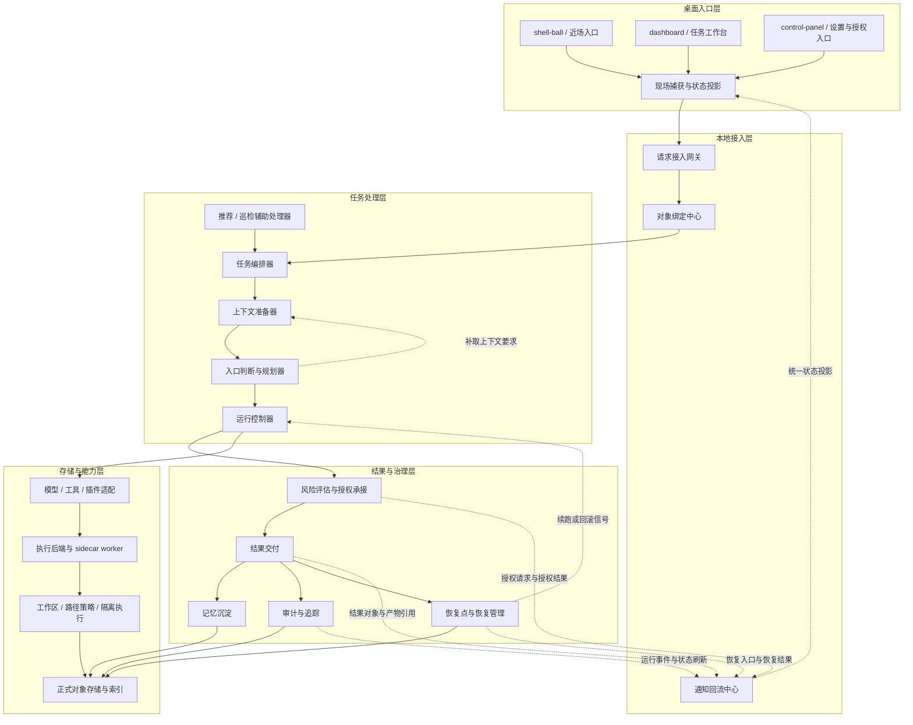

### 4.2 主链与反馈链的阅读方式

上图同时表达两种关系：**主执行链** 和 **正式反馈链**。

- **实线**表示主执行链。请求从桌面入口被采集并送入本地接入层，再由任务处理层编排、规划和运行，随后进入治理与交付，最终落到正式对象存储与能力后端。
- **虚线**表示正式反馈链。它们不创建新的执行主链，而是把规划补取请求、授权对象、结果对象、运行事件和恢复信号回流到上层或前端，再由正式对象体系承接。

为了避免把反馈线误读为“旁路主链”，虚线反馈必须按下表理解：

| 虚线回路     | 来源               | 目标                      | 承载内容                                     | 是否创建新任务 |
| ------------ | ------------------ | ------------------------- | -------------------------------------------- | -------------- |
| 规划补取反馈 | 入口判断与规划器   | 上下文准备器              | `required_context_kinds`、补充上下文需求     | 否             |
| 授权反馈     | 风险评估与授权承接 | 通知回流中心              | `ApprovalRequest`、授权结果                  | 否             |
| 结果反馈     | 结果交付           | 通知回流中心              | `DeliveryResult`、`Artifact`、`Citation`     | 否             |
| 状态反馈     | 审计与追踪         | 通知回流中心              | 任务更新、循环事件、工具调用事件等运行态投影 | 否             |
| 恢复反馈     | 恢复管理           | 通知回流中心 / 运行控制器 | 恢复入口、恢复结果、续跑或回滚信号           | 否             |

反馈链的存在是为了让系统具备“执行中可见、治理中可见、恢复时可见”的能力，但任何虚线都不能绕过 `task` 主对象直接形成新的业务状态。

### 4.3 分层职责、出入口与边界总览

| 层级         | 典型入站                                     | 典型出站                                                     | 负责内容                                                     | 边界约束                                                     |
| ------------ | -------------------------------------------- | ------------------------------------------------------------ | ------------------------------------------------------------ | ------------------------------------------------------------ |
| 桌面入口层   | 用户动作、现场信号、前端投影                 | `AccessRequest`、人工确认动作、视图请求                      | 入口触发、现场采集、状态展示、授权承接                       | 不做意图判断、不做状态机推进、不持久化正式对象               |
| 本地接入层   | JSON-RPC/IPC 请求、治理回流对象              | `AccessRequest`、查询意图、前端投影通知                      | 协议接入、对象绑定、通知回流                                 | 不做执行规划、不直接调用模型/工具、不拥有任务真状态          |
| 任务处理层   | `AccessRequest`、查询结果、恢复/人工控制信号 | `TaskEnvelope`、`PlanningEntry`、`RunTicket`、运行事件       | 编排、上下文准备、入口规划、运行控制、辅助决策               | 是唯一正式任务中枢；worker / plugin / sidecar 不能自持 `task/run` 状态机 |
| 结果与治理层 | 运行输出、拟执行动作、运行事件               | `ApprovalRequest`、`DeliveryResult`、`AuditRecord`、`RecoveryPoint`、记忆写入计划 | 风险评估、授权承接、交付、审计、恢复、记忆沉淀               | 不直接替代任务编排；治理结果必须回到正式对象链               |
| 存储与能力层 | 能力调用请求、存储写入计划、查询请求         | 归一化能力结果、持久化结果、索引召回结果                     | 正式对象存储、索引、模型/工具/插件适配、执行后端、工作区与隔离执行 | 不拥有产品语义，不直接决定任务状态，也不直接面向前端交付     |

### 4.4 层间联系与正式交接件

层与层之间不是“函数互调关系”，而是“正式交接件关系”。当前架构至少应稳定以下交接件：

| 上游层       | 下游层       | 正式交接件                                                   | 说明                                                 |
| ------------ | ------------ | ------------------------------------------------------------ | ---------------------------------------------------- |
| 桌面入口层   | 本地接入层   | `AccessRequest`、人工动作、视图请求                          | 入口层把现场信号归一化后交给接入层，不携带执行决策   |
| 本地接入层   | 任务处理层   | `AccessRequest`、任务锚点、查询锚点                          | 接入层负责对象绑定与锚定，不改写业务判断             |
| 任务处理层   | 结果与治理层 | 运行输出、拟执行动作、运行事件、停止原因                     | 治理层围绕运行产物构造授权、交付、审计与恢复对象     |
| 任务处理层   | 存储与能力层 | 归一化能力调用请求、查询请求                                 | 上层只通过受控适配接口消费底层能力                   |
| 结果与治理层 | 存储与能力层 | `StorageWritePlan`、`ArtifactPersistPlan`、记忆候选、恢复点写入请求 | 治理层不直接写底层实现细节，而是通过正式计划对象落盘 |
| 结果与治理层 | 本地接入层   | `ApprovalRequest`、`DeliveryResult`、`RecoveryPoint`、状态投影 | 回流对象统一经过通知回流中心再投影到前端             |
| 恢复管理     | 运行控制器   | `RecoveryTicket`、续跑或回滚信号                             | 恢复动作必须回到运行主链，而不是走旁路               |

### 4.5 分层约束

总体架构遵循以下分层约束：

- 桌面入口层只处理现场与展示，不理解 `run / step / event / tool_call` 的内部兼容结构。
- 本地接入层可以做协议校验、对象绑定和通知投影，但不能承担编排器或运行控制器的职责。
- 任务处理层是唯一正式任务中枢；同一会话下的主动执行分支必须由统一控制器协调，而不是让多个 worker 或前端入口各自推进状态机。
- 结果与治理层必须真正影响主链，而不是只补日志；高风险动作必须先得到风险判断和授权结论。
- 存储与能力层只能提供真源读写和受控能力，不直接形成产品语义，也不直接把底层结果越层推送到前端。
- 任何模型、工具、插件、worker 或恢复路径产生的结果，都必须回流到正式对象链，再决定是否对外展示或持久化。

## 5. 核心对象模型

### 5.1 核心对象列表

| 对象                    | 作用                           | 归属层                  | 关键说明                                                   |
| ----------------------- | ------------------------------ | ----------------------- | ---------------------------------------------------------- |
| `AccessRequest`         | 描述一次桌面入口触发的原始请求 | 桌面入口层 / 本地接入层 | 包含来源入口、触发动作、原始输入、现场快照引用             |
| `TaskEnvelope`          | 任务编排后的统一入口对象       | 任务处理层              | 统一承接 `task_id`、来源、触发方式、初始输入和目标交付方式 |
| `BaseContextBundle`     | 规划前基础上下文包             | 任务处理层              | 由文本、选区、文件、页面、窗口、错误、剪贴板等基础现场组成 |
| `PlanningEntry`         | 入口判断与规划器的正式产物     | 任务处理层              | 描述意图、执行模式、补充上下文需求、治理要求和回退策略     |
| `ResolvedContextBundle` | 按规划补齐后的上下文包         | 任务处理层              | 在基础上下文上叠加记忆命中、能力可用性、预算和策略约束     |
| `RunTicket`             | 运行控制器接收的可执行票据     | 任务处理层              | 由任务、规划、上下文、治理要求和交付策略组合而成           |
| `Task`                  | 任务主对象                     | 任务处理层 / 持久化层   | 面向用户表达一个可追踪、可恢复、可治理的任务               |
| `Run`                   | 某次具体执行尝试               | 任务处理层 / 持久化层   | 一个任务可以对应多次执行尝试                               |
| `TaskStep`              | 任务执行过程中的步骤记录       | 任务处理层              | 用于时间线、调试、恢复与用户可见的过程说明                 |
| `ApprovalRequest`       | 风险与授权请求                 | 结果与治理层            | 在高风险动作前生成并回流前端等待确认                       |
| `DeliveryResult`        | 结果交付对象                   | 结果与治理层            | 可包含摘要、结构化结果、产物引用、气泡、通知和后续动作     |
| `AuditRecord`           | 审计记录                       | 结果与治理层            | 记录关键动作、授权、失败、回滚和重要外部操作               |
| `RecoveryPoint`         | 恢复点                         | 结果与治理层            | 为失败重试、回滚、续跑和恢复提供挂载点                     |
| `RecommendationItem`    | 推荐项                         | 任务处理层              | 从环境、历史或未完成事项生成，不等于正式任务               |
| `InspectionItem`        | 巡检项 / 待办项                | 任务处理层              | 通过巡检或历史结果派生，可升级为任务                       |
| `Artifact`              | 产物对象                       | 结果与治理层 / 持久化层 | 如文件、报告、摘要、链接、补丁等                           |
| `Citation`              | 引用对象                       | 结果与治理层            | 标记结果所基于的上下文、文件或来源                         |

### 5.2 对象关系图

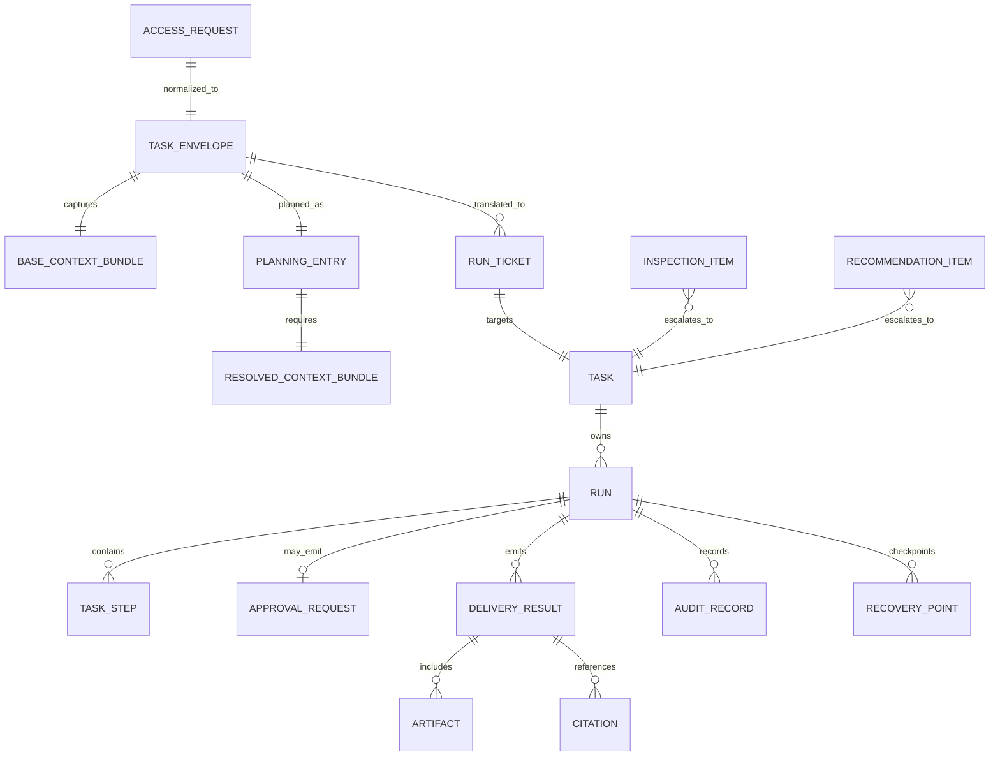

该图说明对象承接关系：请求被绑定为任务入口对象，规划器产出正式规划项，运行控制器消费运行票据，治理与交付层再把正式结果对象回流前端并写入持久化层。

### 5.3 对象边界约束

- `AccessRequest`、`BaseContextBundle` 更偏向短生命周期运行态对象。
- `Task`、`Run`、`TaskStep` 是主状态机对象，应有稳定标识和可追踪关系。
- `PlanningEntry` 必须是结构化产物，不能只是一段解释性文本。
- `ApprovalRequest`、`DeliveryResult`、`AuditRecord`、`RecoveryPoint` 必须由正式模块生产，不能散落在临时日志里。
- `RecommendationItem`、`InspectionItem` 默认不是正式任务，只有在升级条件满足后才进入主任务链。

## 6. 分层架构与子模块设计

### 6.1 桌面入口层

#### 6.1.1 职责定位

桌面入口层负责把用户现场转化为可接入的请求，并把运行状态和结果以最小打扰方式返回给用户。该层是“任务触发层”和“状态展示层”，不是“任务决策层”。

#### 6.1.2 子模块图

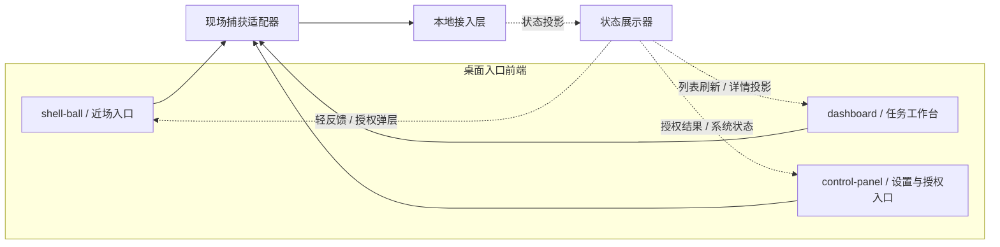

#### 6.1.3 子模块说明

- **shell-ball / 近场入口**：承接悬浮球、右键菜单、选区动作、错误现场触发、文件拖拽等轻量入口，强调“在当前现场直接发起任务”。
- **dashboard / 任务工作台**：承接任务列表、任务详情、历史结果、推荐事项和恢复入口等结构化视图。
- **control-panel / 设置与授权入口**：承接系统设置、能力状态、授权处理和安全相关人工动作。
- **现场捕获适配器**：负责把文本、选区、文件、页面、窗口、剪贴板、错误等信息封装为 `AccessRequest` 所需字段，并把入口层的事实性输入统一送往本地接入层。
- **状态展示器**：负责接收通知回流中心投影出来的正式前端状态，包括运行中状态、授权请求、结果摘要、恢复入口和任务刷新；它不直接消费后端真源对象，而是消费接入层统一投影后的前端状态。

#### 6.1.4 设计要点

桌面入口层只采集事实，不做意图判断；只展示状态，不做运行控制。这样可以避免桌面端逻辑逐渐侵入主状态机，也使接入层能面对统一的请求对象工作。入口层允许存在多种入口形态，但这些入口最终都必须汇聚到统一的 `AccessRequest` 口径。层级关系在这一层不以额外小节单独强调，而是直接体现在“现场捕获适配器向下送入本地接入层、状态展示器从本地接入层承接投影”这对自然关系里。

#### 6.1.5 进入条件与输出对象

| 子模块                         | 典型进入条件                                   | 输出对象或动作               | 下游去向                    |
| ------------------------------ | ---------------------------------------------- | ---------------------------- | --------------------------- |
| shell-ball / 近场入口          | 选区动作、悬浮球点击、错误现场触发、文件拖拽   | 标准化入口动作、轻量补充输入 | 现场捕获适配器              |
| dashboard / 任务工作台         | 打开任务中心、查看任务详情、接受推荐、查看结果 | 结构化视图请求、人工控制动作 | 现场捕获适配器 / 本地接入层 |
| control-panel / 设置与授权入口 | 查看能力状态、处理授权、系统设置               | 授权动作、配置动作、诊断请求 | 现场捕获适配器 / 本地接入层 |
| 现场捕获适配器                 | 收到入口动作与现场信号                         | `AccessRequest`              | 本地接入层                  |
| 状态展示器                     | 收到任务更新、授权请求、结果摘要、恢复入口     | 前端可见投影                 | 各入口子模块                |

#### 6.1.6 入口层的反馈承接规则

桌面入口层对反馈对象的处理必须保持一致：

- **近场入口** 只承接轻反馈，例如短摘要、授权弹层、快速补充输入和推荐提示。
- **工作台入口** 承接结构化反馈，例如任务列表刷新、步骤详情、恢复入口、历史结果和审计摘要。
- **状态展示器** 只消费正式对象的前端投影，不重新发明业务状态；`task`、`approval_request`、`delivery_result` 的正式状态始终以后端对象为准。
- **现场捕获适配器** 只负责补充和归一化事实，不根据界面状态直接改写任务主状态。

#### 6.1.7 层内协作时序图

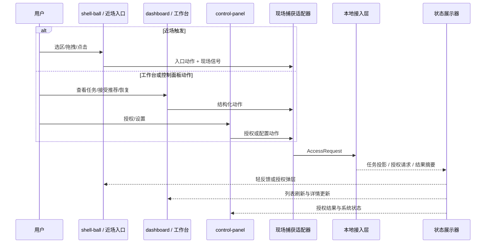

#### 6.1.8 边界约束

- 入口层不能直接生成 `PlanningEntry`、`RunTicket` 或任何治理对象。
- 入口层不能直接消费底层 `run / step / event / tool_call` 真源对象，只能消费本地接入层投影后的前端对象。
- 入口层的用户动作可以形成新的 `AccessRequest`，但不能直接改写既有任务的正式状态。
- 新的入口形态必须复用统一的现场捕获和状态展示规则，而不是另建一套任务协议。

### 6.2 本地接入层

#### 6.2.1 职责定位

本地接入层负责承接入口层发来的请求，把协议层数据转换成系统内部对象，并将任务状态、授权请求和结果通知统一回流到桌面入口。

#### 6.2.2 子模块图

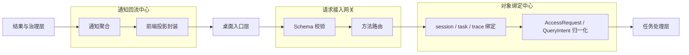

#### 6.2.3 子模块说明

- **Schema 校验**：对 JSON-RPC 请求、控制动作和查询参数做结构校验与最小错误封装。
- **方法路由**：将方法名映射到稳定的业务入口，区分任务请求、查询请求、授权动作、恢复动作和设置动作。
- **session / task / trace 绑定**：把请求锚定到 `session`、`task`、`trace` 这类对象锚点上，形成后续主链和回流链都可追踪的上下文。
- **AccessRequest / QueryIntent 归一化**：把协议载荷转成内部对象，不把协议层字段直接泄漏给下游；归一化之后由任务处理层继续编排或查询装配。
- **通知聚合**：统一收口任务更新、结果交付、循环事件、工具调用事件、授权和恢复等正式通知，它的上游既包括治理层，也包括任务运行过程中产生的正式事件。
- **前端投影封装**：把后端正式对象投影成前端可消费的列表刷新、详情更新、气泡、授权弹层和结果入口，再统一回到桌面入口层。

#### 6.2.4 设计要点

接入层必须保持“薄”：它可以识别对象、分配关联、转译协议，但不能承担任务编排、风险判断和执行控制，否则系统会形成入口逻辑与主逻辑双中心。接入层的核心价值不在业务推理，而在**对象收口**和**回流统一**。层级关系也不应额外插成孤立说明，而应直接写进接入对象流转与通知回流的自然路径中。

#### 6.2.5 接入对象流转展开图

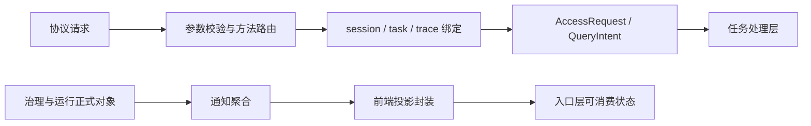

该图强调两条路径：一条是“请求进入后如何变成正式内部对象”，另一条是“后端正式对象如何重新变成前端可消费投影”。接入层负责的不是业务判断，而是对象进入和对象回流的统一收口。

#### 6.2.6 通知回流分类

| 回流类型   | 典型对象                                 | 前端承接位置               | 接入层责任                             |
| ---------- | ---------------------------------------- | -------------------------- | -------------------------------------- |
| 状态回流   | `task`、`run` 的阶段变化投影             | 任务列表、任务详情、轻提示 | 统一状态字段、去重、节流和刷新范围控制 |
| 授权回流   | `ApprovalRequest`、授权结果              | 授权弹层、安全面板         | 保持授权对象与任务对象的关联锚点       |
| 结果回流   | `DeliveryResult`、`Artifact`、`Citation` | 结果气泡、详情页、产物入口 | 统一短摘要与完整结果的呈现出口         |
| 恢复回流   | `RecoveryPoint`、恢复结果                | 任务详情、恢复入口         | 维持恢复动作与原任务链的可追踪关系     |
| 运行时回流 | 运行循环事件、工具调用事件、停止原因     | 任务详情、调试视图、轻提示 | 统一生命周期事件和细粒度运行时投影     |

#### 6.2.7 边界补充

- 本地接入层可以缓存“本次请求与哪个 `task/session/trace` 相关”，但不能私有化真正的任务状态。
- 本地接入层可以做视图级结果装配，但不能从底层 `run/step` 临时拼出未被正式定义的业务对象。
- 所有前端通知都必须通过通知回流中心统一出去，避免不同后端模块各自推送导致前端状态不一致。

#### 6.2.8 输入输出与边界约束

| 子模块       | 输入                               | 输出                                | 边界约束                 |
| ------------ | ---------------------------------- | ----------------------------------- | ------------------------ |
| Schema 校验  | JSON-RPC/IPC 请求                  | 校验通过的协议载荷 / 统一错误       | 不解释业务意图           |
| 方法路由     | 方法名、协议载荷                   | 稳定业务入口选择                    | 不决定任务流程           |
| 对象绑定中心 | 协议载荷、锚点信息                 | `AccessRequest`、查询意图、回流锚点 | 不直接改写任务真状态     |
| 通知聚合     | 正式状态对象、治理对象、运行时事件 | 内部统一通知                        | 不丢失对象关联和时间顺序 |
| 前端投影封装 | 内部统一通知                       | 前端可消费状态                      | 不创造新的正式业务对象   |

#### 6.2.9 层内协作时序图

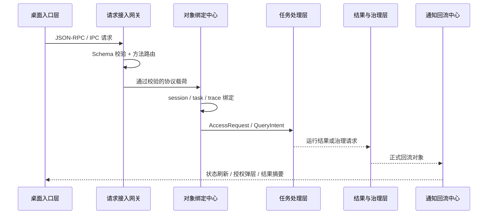

### 6.3 任务处理层

#### 6.3.1 职责定位

任务处理层是系统的核心。它负责把接入层送来的任务入口对象组织成可执行主链路，并对推荐、巡检和待办升级等辅助链路进行统一收口。

这一层的关键原则是：**主状态机由确定性的控制器掌握，模型能力只在受控执行分支内参与**。因此，任务编排、上下文补齐、入口判断、执行模式选择和运行推进都必须形成明确的结构化中间产物，而不是依赖隐式约定。

#### 6.3.2 子模块图

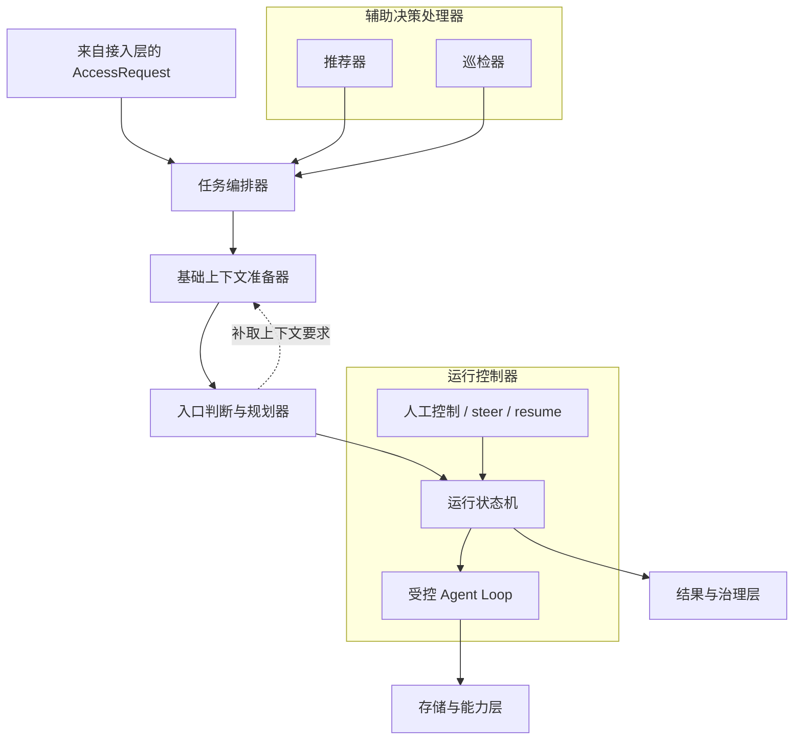

#### 6.3.3 子模块说明

**任务编排器**负责主链路的统一入口。它接收 `AccessRequest`，生成或关联 `TaskEnvelope`，确定任务主标识、来源、触发方式、初始交付偏好和基础执行约束。编排器不是一个“让模型自由决定流程”的黑盒，而是系统主状态机的第一个控制点。它负责决定任务是进入 `waiting_input`、`confirming_intent`、正式运行，还是被挂起为辅助项。

**基础上下文准备器**负责形成可供规划使用的基础上下文包。它首先生成 `BaseContextBundle`，其中包含文本、选区、错误信息、文件列表、页面标题、页面地址、窗口标题、可见文本、剪贴板和最近动作等现场信息。它的职责是“收集并归一化事实”，不是“基于事实下判断”。

**入口判断与规划器**负责决定任务接下来该如何进入运行态。它需要输出结构化 `PlanningEntry`，至少包含意图、执行模式、所需补充上下文、治理要求、直接交付策略和回退策略。当前实现仍偏轻量，但架构上它必须承担“把基础上下文变成正式运行入口”的职责，而不是只给出一句解释性文本。规划结果若要求进一步补齐上下文，补取要求应自然回到上下文准备器，而不是在图外另加说明块。

**运行控制器**负责承接 `RunTicket` 并驱动任务真正进入执行态。它内部至少包括三类职责：运行状态机、受控 Agent Loop 和人工控制/续跑控制。运行状态机维护 `task/run/step` 关系、时间线和状态推进；受控 Agent Loop 在特定执行模式下以可停止、可观察、可追因的方式推进多轮执行；人工控制/续跑控制负责 pause、resume、cancel、steer、recovery 等人为或恢复型控制动作。运行中的能力调用自然流向存储与能力层，而运行输出、拟执行动作和停止原因自然流向结果与治理层。

**推荐器**负责根据当前场景、历史结果、未完成事项、感知信号和用户反馈生成推荐项。推荐项保持在辅助链，不直接写入任务主状态机，并且受 fingerprint、反馈和 cooldown 约束。

**巡检器**负责围绕未完成任务、已完成任务、notepad 项和目标来源执行周期性或按需巡检，生成 `InspectionItem`、建议列表和可升级事项。它负责“发现机会”和“整理待办”，而不直接承担生成类执行主链。

#### 6.3.4 任务处理层的正式中间产物

| 阶段           | 输入                                                   | 输出                                   | 说明                                           |
| -------------- | ------------------------------------------------------ | -------------------------------------- | ---------------------------------------------- |
| 任务编排       | `AccessRequest`                                        | `TaskEnvelope`                         | 形成统一任务入口对象                           |
| 基础上下文准备 | `TaskEnvelope`                                         | `BaseContextBundle`                    | 聚合现场快照，不做决策                         |
| 入口判断与规划 | `TaskEnvelope + BaseContextBundle`                     | `PlanningEntry`                        | 形成意图、执行模式、治理与回退决策             |
| 补充上下文准备 | `PlanningEntry + BaseContextBundle`                    | `ResolvedContextBundle`                | 按规划结果补齐缺失上下文                       |
| 运行票据生成   | `TaskEnvelope + PlanningEntry + ResolvedContextBundle` | `RunTicket`                            | 把任务、上下文、规划与治理要求组装成可执行票据 |
| 运行推进       | `RunTicket`                                            | `Task / Run / TaskStep + RuntimeEvent` | 驱动主状态机进入执行态                         |
| 辅助链升级     | `RecommendationItem / InspectionItem`                  | 新的 `AccessRequest` 或 `TaskEnvelope` | 通过升级条件重新进入正式主链                   |

#### 6.3.5 设计要点

- 任务编排权必须由系统控制器掌握，而不是由模型自由决定主流程。
- 规划器必须输出结构化对象，不能只输出自然语言解释。
- 上下文准备分为基础采集和按规划补齐两个阶段，避免一次性收集过量上下文。
- 运行控制器必须同时承担“状态控制”和“执行驱动”，但两者的内部实现可以拆分。
- 推荐和巡检必须作为辅助链路存在，不能画成所有任务的固定后继步骤。
- 同一会话下的主动执行分支需要被统一协调，不能让多个 worker 或入口各自推进主状态机。
- 所有能力调用结果都必须继续回流到正式对象链，而不是由调用者私自直接返回给前端。

#### 6.3.6 子模块协作展开图

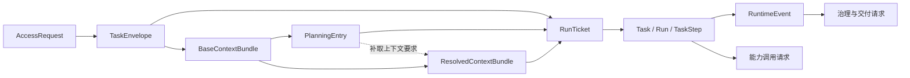

这个展开图把任务处理层内部真正需要稳定下来的“中间对象链”画出来了。它说明：架构上真正重要的不是某个函数名，而是这些对象之间的承接关系是否稳定、是否可追踪、是否能被后续治理和恢复继续消费。对子模块与下一层级的联系，也直接通过“能力调用请求”和“治理与交付请求”自然体现出来。

#### 6.3.7 运行控制器内部职责展开

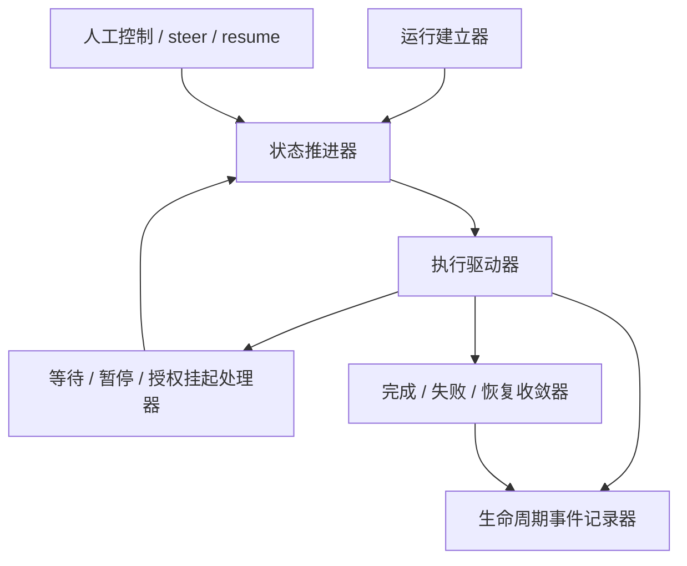

运行控制器不是单一黑盒，而应至少拆成以下内部职责：

- **运行建立器**：根据 `RunTicket` 创建或恢复 `task/run/step` 的初始运行骨架。
- **状态推进器**：统一推进排队、运行中、等待确认、等待输入、暂停、完成、失败、取消和恢复中的状态。
- **执行驱动器**：按 `execution_mode` 选择一次性执行、受控循环、工具调用或恢复重放。
- **生命周期事件记录器**：沉淀运行循环事件、工具调用事件、停止原因和重要运行时事件，供任务详情和调试视图消费。
- **等待 / 暂停 / 授权挂起处理器**：在授权、补充输入、外部资源等待等情况下挂起运行，并保留重新进入执行态所需上下文。
- **完成 / 失败 / 恢复收敛器**：把本轮运行的停止原因、关键输出、失败信息和恢复结果收敛回正式对象链。
- **人工控制 / steer / resume**：承接 follow-up 指令、pause/resume/cancel 和恢复续跑等人控动作。

#### 6.3.8 状态推进与等待收敛

架构上，任务处理层至少应区分以下控制阶段：

| 控制阶段                 | 进入条件                                | 退出条件                     |
| ------------------------ | --------------------------------------- | ---------------------------- |
| 输入待补                 | 现场信息不足以形成可执行任务            | 收到补充输入或被取消         |
| 意图待确认               | 已具备可执行输入，但仍需确认            | 用户确认、拒绝或改写任务     |
| 已排队                   | 会话串行或资源条件暂未满足              | 获得运行机会                 |
| 运行中                   | 运行控制器已持有 `RunTicket` 并推进执行 | 完成、失败、挂起或取消       |
| 授权等待                 | 风险动作需要人工授权                    | 授权通过、拒绝或超时         |
| 补充输入等待             | 执行中需要更多人工输入                  | 输入补齐或取消               |
| 暂停中                   | 人工或系统主动暂停                      | resume / cancel              |
| 恢复中                   | 由恢复票据重新进入执行态                | 完成、再次失败或取消         |
| 已完成 / 已失败 / 已取消 | 主链收敛结束                            | 只允许查询、恢复或派生新任务 |

这里列出的不是最终协议枚举，而是架构上必须明确存在的控制阶段。当前代码中的若干外显状态会映射到 `waiting_input`、`confirming_intent`、`processing`、`paused` 以及终态组合，但架构层必须先把这些等待态和收敛态定义清楚，后续协议才会稳定。

#### 6.3.9 辅助链路并入规则

辅助决策处理器输出的推荐项、巡检项和待办升级信号，默认都不直接写入主状态机。它们需要经过以下规则才能并入正式任务链：

1. 先形成 `RecommendationItem` 或 `InspectionItem` 等辅助对象。
2. 在用户接受、规则命中或系统明确触发升级条件后，再生成新的 `AccessRequest` 或 `TaskEnvelope`。
3. 升级后的任务与原辅助项保持关联，但运行状态、授权和结果交付全部重新进入正式主链。
4. 推荐项的正负反馈、忽略和 cooldown 只影响后续推荐生成，不直接等价于任务状态。
5. 巡检结果负责发现待处理事项和 stale task 风险，但不把 notepad 状态直接混入运行态 `run_status`。

#### 6.3.10 子模块输入输出与边界约束

| 子模块           | 正式输入                                     | 正式输出                                     | 边界约束                                          |
| ---------------- | -------------------------------------------- | -------------------------------------------- | ------------------------------------------------- |
| 任务编排器       | `AccessRequest`、会话/任务锚点               | `TaskEnvelope`                               | 掌握主编排权，但不直接调用底层能力完成业务输出    |
| 基础上下文准备器 | `TaskEnvelope`、补取要求                     | `BaseContextBundle`、`ResolvedContextBundle` | 只收集和归一化事实，不推进状态机                  |
| 入口判断与规划器 | `TaskEnvelope + BaseContextBundle`           | `PlanningEntry`                              | 做读式判断和规划，不直接写任务终态                |
| 运行控制器       | `RunTicket`、恢复信号、人控信号              | `Task / Run / TaskStep`、`RuntimeEvent`      | 是唯一正式运行推进点，worker 不能绕过它持有主状态 |
| 推荐器           | 场景信号、历史结果、未完成事项、用户反馈     | `RecommendationItem`                         | 不直接创建正式任务                                |
| 巡检器           | 目标来源、未完成任务、已完成任务、notepad 项 | `InspectionItem`、建议集                     | 不把巡检状态混入运行态真源                        |

#### 6.3.11 层内协作时序图

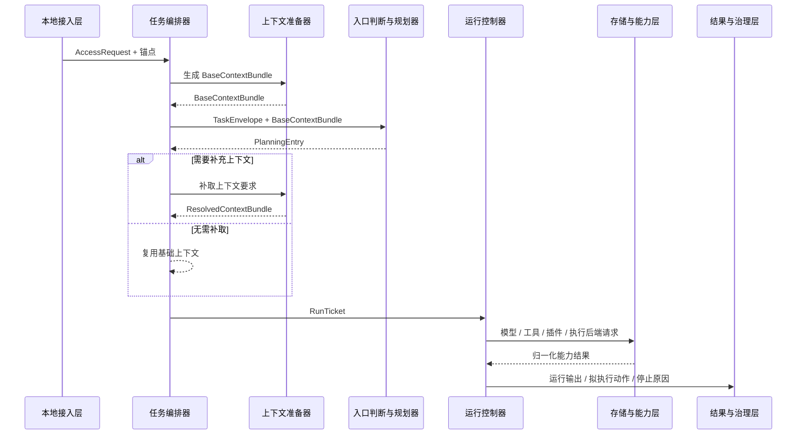

### 6.4 结果与治理层

#### 6.4.1 职责定位

结果与治理层负责把运行态输出转化为可交付、可审计、可恢复的正式结果，并在高风险动作前插入授权与治理机制。该层不是执行主链路的外置附属，而是任务完成闭环的正式部分。

#### 6.4.2 子模块图

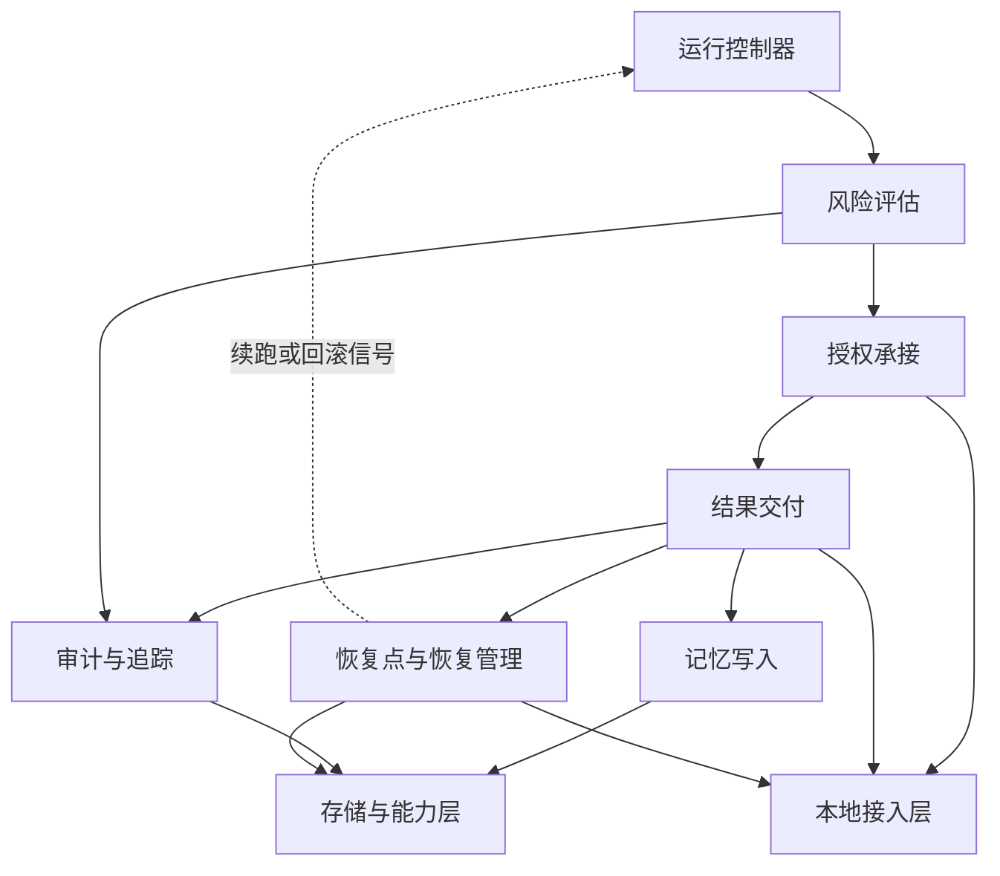

#### 6.4.3 子模块说明

- **风险评估**：围绕拟执行动作、能力可用性、命令预览、影响范围和工作区边界输出稳定的评估结果，例如 `deny`、`approval_required`、`checkpoint_required` 和风险级别。它负责“判断”，不直接生成 `ApprovalRequest`，也不直接推进状态机。
- **授权承接**：在风险评估要求人工确认时，把风险结果物化为正式授权对象并回流前端，等待授权结果后再把允许/拒绝信号交还主链。它向上通过本地接入层回流，向下不直接控制能力执行。
- **结果交付**：将运行输出规范化为 `DeliveryResult`、结果摘要、气泡消息、引用、产物入口和持久化计划；对前端的可见结果通过接入层回流，对正式写入则通过计划对象送入存储与能力层。
- **记忆写入**：从正式结果中提取长期协作所需信息，形成受控的记忆候选和写入计划。
- **审计与追踪**：记录关键动作、授权过程、失败点、外部副作用、运行时追踪和评估摘要，并把长期留痕自然沉淀到正式对象存储。
- **恢复点与恢复管理**：在高风险动作前生成恢复点，在失败、取消和人工触发时提供恢复入口、恢复票据和结果回流；恢复结果向上回流前端，恢复信号则重新并入运行控制器。

#### 6.4.4 设计要点

风险与授权的输出必须是对象化的，而不是一个简单布尔值；结果交付也不能只是一段文本，而应包含交付形式、产物引用、引用来源和后续动作建议。记忆、审计、恢复和追踪都必须围绕正式结果对象展开，不能从临时草稿和未确认输出中直接抽取。层级联系在这一层通过“向上回流、向下写入、向左重新并入运行主链”自然展开，而不是通过额外编号小节硬插进去。

#### 6.4.5 治理对象流转图

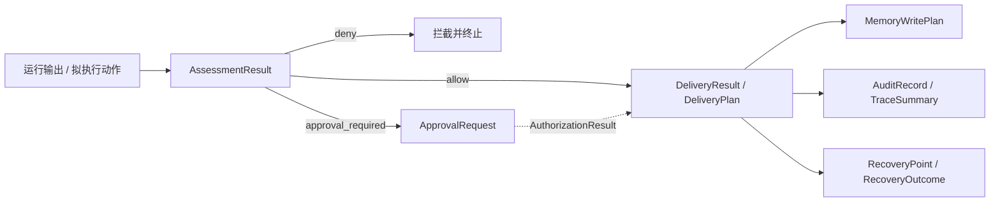

治理对象流转图强调两个事实：其一，授权对象、结果对象、记忆对象、审计对象和恢复对象都来自同一条正式治理链；其二，它们之间不是任意散写关系，而是围绕同一个任务主对象和同一轮运行结果收敛出来的对象包。

#### 6.4.6 结果与治理的反馈职责

| 子模块              | 向前端回流的内容                | 向任务主链回流的内容                                   | 向持久化层写入的内容                               |
| ------------------- | ------------------------------- | ------------------------------------------------------ | -------------------------------------------------- |
| 风险评估 / 授权承接 | `ApprovalRequest`、授权结果摘要 | allow / deny / approval_required / checkpoint_required | 风险摘要、授权记录、影响范围                       |
| 结果交付            | 结果摘要、产物入口、通知        | 交付完成标记、后续动作建议                             | `DeliveryResult`、`Artifact`、`Citation`、写入计划 |
| 记忆写入            | 通常不直接面向前端              | 记忆候选摘要                                           | 记忆写入计划与正式记忆对象                         |
| 审计与追踪          | 调试态下的关键轨迹摘要          | 关键状态变化说明、停止原因说明                         | `AuditRecord`、Trace/Eval 摘要                     |
| 恢复点与恢复管理    | 恢复入口、恢复结果              | `RecoveryTicket`、续跑或回滚指令                       | `RecoveryPoint`、恢复日志                          |

#### 6.4.7 治理层与执行层衔接约束

- 风险评估必须发生在高风险动作执行之前，而不是执行之后补日志。
- 风险评估模块本身只输出稳定判断，不直接创建 `ApprovalRequest`、不推进任务状态机。
- 结果交付必须在“运行输出已经收敛”之后统一发生，不允许工具调用结果直接越层交给前端。
- 审计与恢复必须与 `task/run/step` 稳定关联，否则失败回滚、结果解释和后续排障都会断链。
- 记忆写入必须围绕正式结果对象进行，而不是直接从中间草稿或未确认输出中抽取。
- 恢复点模块负责恢复点能力收口，不直接充当回滚编排器或文件恢复执行器。

#### 6.4.8 输入输出与边界约束

| 子模块           | 正式输入                                   | 正式输出                                                     | 边界约束                                 |
| ---------------- | ------------------------------------------ | ------------------------------------------------------------ | ---------------------------------------- |
| 风险评估         | 拟执行动作、命令预览、能力可用性、影响范围 | `AssessmentResult`                                           | 只做判断，不直接产出前端对象或推进状态机 |
| 授权承接         | `AssessmentResult`、任务锚点、交付偏好     | `ApprovalRequest`、授权结果                                  | 不替代风险评估本身，也不替代运行控制器   |
| 结果交付         | 运行输出、停止原因、交付偏好               | `DeliveryResult`、`StorageWritePlan`、`ArtifactPersistPlan`、气泡消息 | 生成交付对象和计划，但不拥有存储真源     |
| 记忆写入         | 正式结果、阶段摘要、检索命中               | 记忆候选、记忆写入计划                                       | 不负责任务编排，也不定义最终持久化布局   |
| 审计与追踪       | 生命周期事件、授权与执行信息               | `AuditRecord`、Trace/Eval 摘要                               | 不直接改写用户可见结果                   |
| 恢复点与恢复管理 | 高风险动作、影响范围、恢复前快照、恢复请求 | `RecoveryPoint`、恢复票据、恢复结果                          | 不是回滚编排器，也不是执行后端本身       |

#### 6.4.9 层内协作时序图

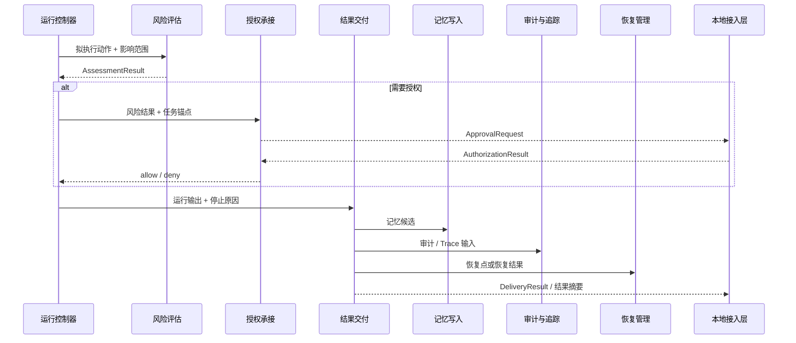

### 6.5 存储与能力层

#### 6.5.1 职责定位

存储与能力层为上层提供稳定的能力供给和持久化支撑，但不掌握产品语义，也不决定任务如何编排。

#### 6.5.2 子模块图

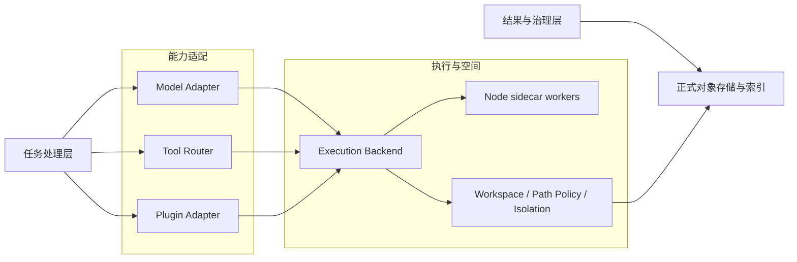

#### 6.5.3 子模块说明

- **正式对象存储与索引**：负责任务、运行、产物、审计、恢复点、记忆摘要和相关索引信息的落盘与读取。它主要承接结果与治理层的正式写入计划，以及执行空间产生的文件和对象落盘结果。
- **Model Adapter**：统一承接模型调用，屏蔽 provider 差异，对上返回标准化模型输出。
- **Tool Router**：统一工具命名、能力选择、参数整形与工具调用结果归一化。
- **Plugin Adapter**：承接插件能力，确保插件结果仍回到正式能力调用结果口径。
- **Execution Backend**：承接命令执行、页面动作、文件级副作用等高副作用能力，并与工作区、路径策略和恢复点机制配合。
- **Node sidecar workers**：承载 Playwright、OCR、媒体处理等外部能力，由执行后端和工具路由在受控条件下调用。
- **Workspace / Path Policy / Isolation**：负责工作区目录、路径边界、临时文件、产物文件、隔离执行空间和副作用边界控制；其文件级结果最终仍需回到正式对象存储与索引。

#### 6.5.4 设计要点

能力层必须通过适配接口暴露能力，不应把底层 provider、工具参数模板和工作区细节直接暴露给任务处理层，否则上层会逐渐与具体实现强耦合。对象存储、执行空间和能力适配必须分离：**存储是真源，执行是副作用，交付是上层决定。** 在图和说明中，任务处理层与治理层对这一层的联系也直接放进主图和子模块图中，而不是拆出额外小节。

#### 6.5.5 数据与执行空间划分

| 子域           | 主要内容                                                     | 架构定位                             |
| -------------- | ------------------------------------------------------------ | ------------------------------------ |
| 正式对象存储   | `task`、`run`、`step`、`delivery_result`、`audit_record`、`recovery_point` 等 | 主对象真源，服务查询、恢复与治理     |
| 本地索引与召回 | 搜索索引、向量索引、辅助检索缓存                             | 为任务处理层提供受控召回能力         |
| 工作区与产物区 | 工作目录、临时文件、产物文件、恢复快照                       | 为执行和交付提供文件级承载空间       |
| 能力适配区     | 模型、工具、插件、Worker、平台接口                           | 统一把底层能力转成受控调用结果       |
| 隔离执行区     | 命令执行、浏览器自动化、OCR、媒体处理等运行环境              | 隔离高副作用执行，防止污染主服务进程 |

#### 6.5.6 能力接入与归一化约束

- 上层只能通过适配接口调用模型、工具、插件和 Worker，不能直接持有底层 provider SDK。
- 能力调用结果必须被归一化为“可继续进入任务主链的标准结果”，不能直接形成前端输出。
- 工作区、隔离执行和对象存储要保持职责分离：文件落盘不等于任务完成，执行成功也不等于结果已交付。
- 存储层提供的是真源读写结果，能力层提供的是执行结果；两者都需要回到上层主链重新判定。

#### 6.5.7 输入输出与边界约束

| 子模块                              | 正式输入                   | 正式输出                           | 边界约束                             |
| ----------------------------------- | -------------------------- | ---------------------------------- | ------------------------------------ |
| 正式对象存储与索引                  | 对象写入计划、查询条件     | 持久化结果、查询结果、索引召回结果 | 不解释产品语义，不代替上层判定       |
| Model Adapter                       | Prompt、上下文、预算       | 标准化模型输出、调用摘要           | 不直接写前端结果                     |
| Tool Router / Plugin Adapter        | 工具名、参数、执行上下文   | 标准化工具/插件结果                | 不私自维护任务状态                   |
| Execution Backend                   | 高副作用操作、隔离策略     | 执行结果、副作用摘要、恢复前材料   | 不拥有任务编排权                     |
| Workspace / Path Policy / Isolation | 文件读写请求、路径边界策略 | 文件结果、路径判断、隔离空间       | 只控制空间与边界，不判定任务是否完成 |

#### 6.5.8 层内协作时序图

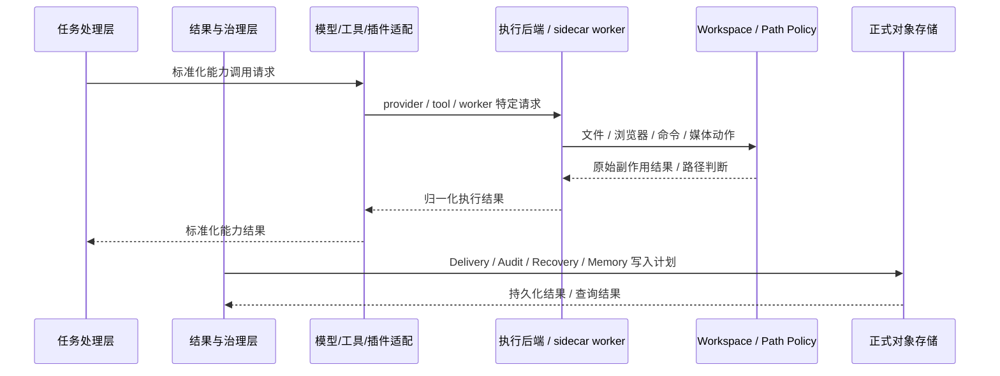

### 6.6 分层协作约束

#### 6.6.1 跨层正式交接件

| 来源层       | 目标层       | 正式交接件                                                   | 约束                                     |
| ------------ | ------------ | ------------------------------------------------------------ | ---------------------------------------- |
| 桌面入口层   | 本地接入层   | `AccessRequest`、人工动作、视图请求                          | 不携带执行决策                           |
| 本地接入层   | 任务处理层   | `AccessRequest`、任务锚点、查询锚点                          | 不替代规划和运行决策                     |
| 任务处理层   | 结果与治理层 | 运行输出、拟执行动作、运行事件、停止原因                     | 治理层围绕正式对象收敛结果               |
| 任务处理层   | 存储与能力层 | 标准化能力调用请求、查询请求                                 | 不能绕过适配层直连 provider 或工作区细节 |
| 结果与治理层 | 本地接入层   | `ApprovalRequest`、`DeliveryResult`、`RecoveryPoint`、状态投影 | 不直接越层触达前端                       |
| 恢复管理     | 运行控制器   | `RecoveryTicket`、恢复结果、续跑信号                         | 必须重新并入正式任务主链                 |

#### 6.6.2 全局协作约束

- **桌面入口层** 只向本地接入层发起正式请求，不直接理解 `run / step / tool_call` 内部结构。
- **本地接入层** 只负责协议收口、对象绑定和结果回流，不替代任务处理层做规划和运行决策。
- **任务处理层** 统一调度结果与治理层，以及存储与能力层，不能绕过它们直连底层 SQLite、工作区或 provider。
- **结果与治理层** 产生的授权、交付、记忆、审计和恢复对象，必须继续回到正式对象链，不直接跳过接入层触达前端。
- **存储与能力层** 只提供真源读写与受控能力，不拥有产品语义，也不主导任务主状态机。

## 7. 核心链路设计

### 7.1 标准任务链路

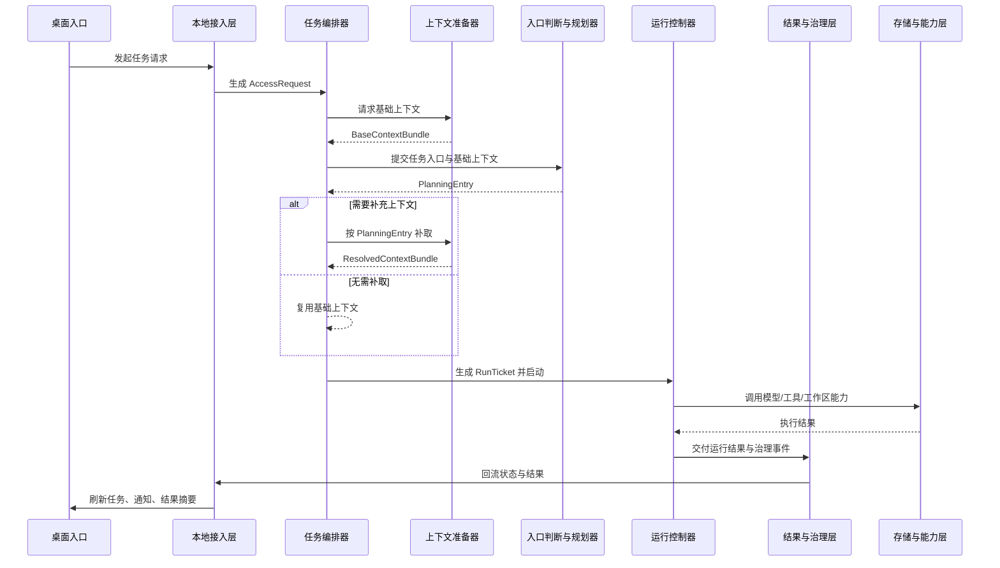

标准任务链路描述的是大多数正式任务的主路径。它从桌面入口采集现场开始，经本地接入层绑定为 `AccessRequest`，再由任务编排器生成 `TaskEnvelope`。随后，上下文准备器先给出基础上下文，规划器基于此形成 `PlanningEntry`；若规划结果认为现有上下文不足，再按规划补齐上下文，最终形成可执行的 `RunTicket` 并交给运行控制器。

这一链路的设计要点如下：

- **先编排，再规划，再执行**。这样可以确保任务有稳定主标识和统一入口对象，避免后续步骤围绕临时请求直接运行。
- **上下文分阶段补齐**。基础上下文优先满足快速进入规划；补充上下文由规划显式驱动，避免无差别收集所有现场信息。
- **运行与治理解耦但不断链**。运行控制器负责推进执行，治理层负责授权、交付、审计和恢复，两者对象上连续、职责上分离。
- **回流中心是唯一前端刷新出口**。状态变化、结果摘要、授权请求和任务更新都通过本地接入层的通知回流中心返回桌面端，避免各模块各自推前端。

### 7.2 授权与风控链路

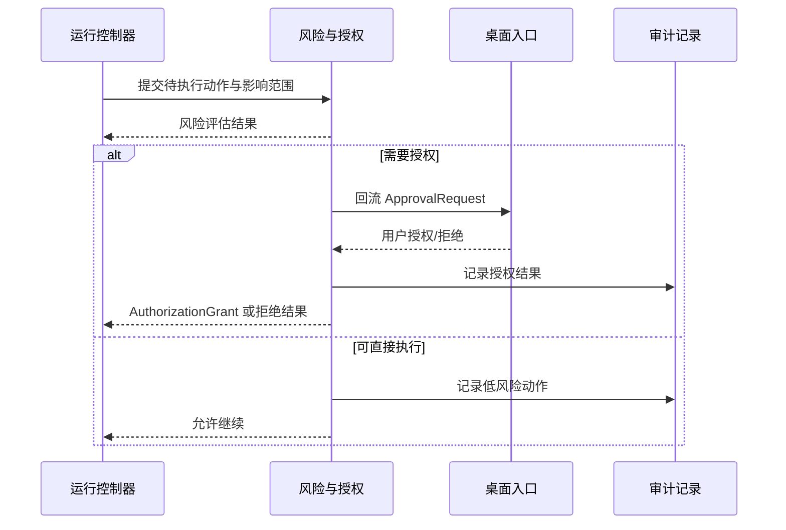

该链路强调两个原则：第一，风险治理要发生在动作执行之前，而不是执行之后补记日志；第二，授权结果必须成为正式对象，供运行控制器继续推进、终止、降级或等待。

### 7.3 推荐与巡检升级链路

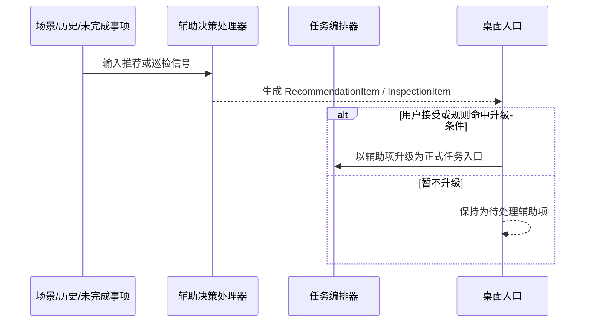

推荐与巡检不是所有任务的固定后继步骤，而是系统从环境和历史中生长出的辅助链路。把它们从主任务串行图中拆出来，能够避免文档误导实现者把它们硬塞进标准执行主链。

### 7.4 恢复与回滚链路

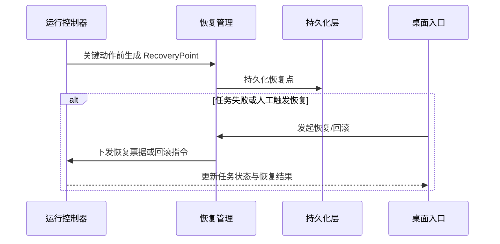

恢复链路的设计重点在于：恢复点必须在关键动作前生成，恢复动作必须有正式入口，回滚或续跑结果必须回到任务主对象上，而不是形成脱离任务的旁路动作。

## 8. 非功能需求（NFR）

### 8.1 性能

- 入口触发到任务创建应保持轻量，基础上下文准备不应阻塞过长时间。
- 高延迟能力调用应通过运行控制器异步推进，并及时回流阶段状态。
- 结果交付应区分即时摘要与完整产物，避免一次性等待全部结果再反馈。

### 8.2 可靠性

- `task/run/step` 状态必须可追踪，失败必须能定位到具体运行阶段。
- 关键外部动作前需要恢复点或明确不可恢复说明。
- 中断、取消、失败、授权拒绝、补充输入等待等状态都必须有明确收敛路径。

### 8.3 安全与治理

- 高风险动作必须先经风险评估与授权流程。
- 审计记录必须覆盖关键副作用动作和授权决策。
- 工作区和执行环境需要具备隔离边界，避免任务间相互污染。

### 8.4 可观测性

- 任务主对象需要沉淀关键时间点、最近动作、停止原因和当前步骤。
- 运行控制器需要提供足够的生命周期事件，支撑任务列表、调试视图和恢复入口。
- 结果对象应保留摘要、引用、产物与状态，避免只剩一段不可追踪文本。

### 8.5 可扩展性

- 新入口形态应通过桌面入口层扩展，而不直接侵入接入层和任务主链。
- 新能力接入应通过适配层暴露，而不直接把底层依赖散布到任务处理层。
- 新的辅助链路应优先以推荐项、巡检项、待办升级方式接入，而不是强行改写标准任务主链。

### 8.6 可维护性

- 总体架构、协议设计、数据设计、模块详细设计和工程规范必须各自收口，不交叉污染。
- 任务链路中的中间产物应保持稳定命名，避免实现阶段不断改名导致文档失效。
- 图示必须配文字解释，避免读者只能从图中猜测语义。

## 9. 当前代码映射与实现约束

### 9.1 关键代码映射

| 架构角色                  | 当前实现线索                                                 |
| ------------------------- | ------------------------------------------------------------ |
| 桌面入口层                | `apps/desktop`（多入口前端）                                 |
| 协议与接入边界            | `packages/protocol`、`services/local-service/internal/rpc`   |
| 任务编排器                | `services/local-service/internal/orchestrator`               |
| 上下文准备器              | `services/local-service/internal/context`                    |
| 入口判断与规划器          | `services/local-service/internal/intent`                     |
| 运行控制器（状态机）      | `services/local-service/internal/runengine`                  |
| 运行控制器（受控循环）    | `services/local-service/internal/agentloop`                  |
| 风险评估                  | `services/local-service/internal/risk`                       |
| 结果交付                  | `services/local-service/internal/delivery`                   |
| 记忆边界                  | `services/local-service/internal/memory`                     |
| 审计 / 恢复 / 追踪        | `services/local-service/internal/audit`、`checkpoint`、`traceeval` |
| 辅助决策                  | `services/local-service/internal/recommendation`、`taskinspector` |
| 感知与执行后端            | `services/local-service/internal/perception`、`execution`、`platform`、`workers/*` |
| 模型 / 工具 / 插件 / 存储 | `services/local-service/internal/model`、`tools`、`plugin`、`storage` |

当前代码已经显示出较清晰的主链：`orchestrator.Service` 作为本地服务任务入口，依赖上下文、意图、运行、交付、风控、记忆、审计、恢复、推荐和巡检等模块；`context.Service` 负责将请求折叠为上下文快照；`intent.Service` 提供轻量建议；`runengine.Engine` 维护任务记录与运行态；`agentloop.Runtime` 提供带停止原因的受控循环。

### 9.2 当前实现约束

- 当前 `intent.Service` 仍偏轻量，更接近入口判断与建议器，完整 `PlanningEntry` 结构需要进一步固化。
- 当前 `context.Service` 主要体现基础上下文采集与归一化，按规划补取的第二阶段能力需要在架构上预留。
- 当前 `risk.Service` 输出的是稳定、可测试的评估结果，不直接生成 `ApprovalRequest`，也不直接推进状态机。
- 当前 `delivery.Service` 已经形成正式交付对象和写入计划，但正式内容写入仍需依赖上层和存储层协作。
- 当前 `checkpoint` 模块定位为恢复点能力的最小收口层，而不是回滚编排器或文件恢复执行器。
- 当前 `memory` 模块负责本地 memory 边界、检索归一化和 mirror reference 组装，真实持久化接口仍在继续固化。
- 当前 `runengine.Engine` 已经承载大量任务态字段，说明主状态机对象已逐步成形，但还需要更清晰的正式对象边界。
- 当前 `agentloop.Runtime` 已经具有停止原因与生命周期事件语义，适合作为受控执行分支，而不应上升为系统总编排器。
